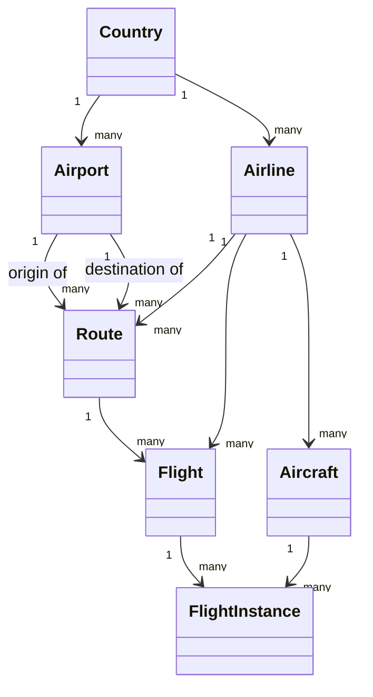

# aero-hex-ai — Domain Model (Static View)

> Source of truth for this document is the code: `domain/`, `application/`, `shared-kernel/`,
> `adapter-http/` (DTO validators), and `infrastructure/migration/` (Flyway schema). Aviation
> concept definitions are adapted from `../incubator/README.adoc` (`=== Model` section), a prior
> research project by the same author covering the same domain. Every rule is traced to a file and
> line; anything not explicit in code is marked `[ASSUMPTION]`, and anything documented/implied but
> not actually enforced is marked `[MISSING]`.

## 1. Ubiquitous Language / Glossary

| Term | Definition |
|---|---|
| Country | A nation with its own government, occupying a particular territory. Identified by a two-letter code. ICAO documents call this a *Contracting State*; *Country* is the everyday IATA/industry term used here. (adapted from `../incubator/README.adoc`) |
| Airport | A complex of runways and buildings for the take-off, landing, and maintenance of civil aircraft, with facilities for passengers. Belongs to one Country. Formally an *Aerodrome* per ICAO Annex 14; *Airport* is the standard IATA/industry term for a public civil aerodrome. (adapted from `../incubator/README.adoc`) |
| Airline | An organization providing a regular public service of air transport on one or more routes. Belongs to one Country of registration. Also called an *Air Carrier* or *Operator* in ICAO terminology. (adapted from `../incubator/README.adoc`) |
| Aircraft | An airplane capable of flight to transport people and cargo. Belongs to one Airline. The standard term in both ICAO (Annex 7) and IATA usage — no industry synonym needed. (adapted from `../incubator/README.adoc`) |
| Route | A way or course taken in getting from a starting point (Airport) to a destination (Airport), operated by an Airline. Also called a *City Pair* in IATA fare/schedule terminology. (adapted from `../incubator/README.adoc`) |
| Flight | A scheduled, timetabled service operated by an Airline along a Route, identified by an Airline Designator + Flight Number per IATA's Standard Schedules Information Manual (SSIM). (adapted from `../incubator/README.adoc`) — modeled in code but **not yet backed by any database table** ([MISSING], see §7). |
| FlightInstance | An actual, dated occurrence of a Flight, operated by a specific Aircraft — the SSIM/AIDX equivalent of an *Operating Flight* (sometimes called a *Flight Instance* in scheduling systems). Distinct from a passenger's *Journey*, which in IATA/NDC usage denotes an end-to-end itinerary that may span several such occurrences. (adapted from `../incubator/README.adoc`) — modeled in code but **not yet backed by any database table** ([MISSING], see §7). |
| IATA Code | The 3-letter alphabetic code assigned by the International Air Transport Association identifying an Airport (e.g. `MAD`). |
| ICAO Code | The alphabetic code assigned by the International Civil Aviation Organization. Used for two *different* concepts at two *different* lengths in this codebase: a 4-letter Airport code (e.g. `LEMD`) and a 3-letter Airline code (e.g. `AEA`) — see BR-03/§6. |
| Country Code | ISO 3166-1 alpha-2 code identifying a Country (e.g. `ES`). Validated against the full 249-code standard on creation — see BR-16. |
| Registration | The international code identifying a specific physical Aircraft (e.g. `EC-MIG`); formally the *Aircraft Registration Mark* per ICAO Annex 7, informally the *tail number*. |
| Outbox Event | A durable record of a domain event pending publication to Kafka, part of the transactional outbox pattern (`domain/model/OutboxEvent.scala`). |
| Pagination | A `(page, pageSize)` request shape shared by every list endpoint (`shared-kernel/Pagination.scala`). |

## 2. Bounded Context

**Name:** Aviation Network (reference/master data + route network for an airline network — countries,
airports, airlines, aircraft, routes, and the flights/flight instances that run on them).

**Explicitly out of scope** (no model, no port, no endpoint references any of these anywhere in the
codebase):
- Ticketing, pricing, fare rules, seat inventory
- Passenger identity, booking, check-in, boarding
- Crew rostering / duty-time management
- Baggage handling
- Loyalty / frequent-flyer programs
- Real-time flight tracking / ATC data
- Scheduling *optimization* (the model records a schedule, `Flight.schedDeparture`/`schedArrival`, but
  does not compute or validate one)

## 3. Conceptual Domain Model

## 4. Entities and Value Objects

| Name | Kind | Identity | Key Attributes & Invariants | Module / File |
|---|---|---|---|---|
| `Country` | Entity (Aggregate Root) | `CountryCode` (natural key) | `code: CountryCode`, `name: String` (no blank check in the domain type itself) | `domain/model/Country.scala` |
| `CountryCode` | Value Object — ZIO Prelude `Newtype[String]` (`IataCode`/`IcaoCode`/`Registration` were later migrated to the same pattern; `FlightCode`/`RouteId`/`FlightInstanceId`/`OutboxEventId` remain plain Scala 3 opaque types) | — | `assertion = matches("^[a-zA-Z]{2}$".r)` enforces BR-01 at construction. `apply` validates compile-time literals (a malformed literal fails to *compile*); `make` validates runtime strings, returning `Validation[String, CountryCode]` bridged to `IO[DomainError, CountryCode]` via `.toZIO` (`CreateCountryRequest.toCommand`); `unsafeMake` bypasses validation for already-trusted data (DB reads, HTTP path params already Tapir-validated) | `domain/model/Country.scala:1-27` |
| `Airport` | Entity (Aggregate Root) | `IataCode` (natural key) | `iataCode: IataCode`, `icaoCode: IcaoCode` (shares the type with `Airline`/`Route`/`Flight`/`Aircraft`), `name`, `city` — no `countryCode` field; resolved by relationship, `AirportRepository.save`/`update` take it as a separate parameter | `domain/model/Airport.scala` |
| `IataCode` | Value Object — ZIO Prelude `Newtype[String]` (migrated from a plain opaque type) | — | `assertion = matches("^[a-zA-Z]{3}$".r)` enforces BR-02 at construction. `CreateAirportRequest.toCommand` calls `IataCode.make(req.iata).toZIO`, failing with `DomainError.InvalidIataCode` (400); the Tapir-level `Validator.pattern` was removed once this landed (kept `minLength`/`maxLength`). `Route.origin`/`Route.destination` (cross-entity references, not `Airport` itself) still construct via `unsafeMake`, no real check on those fields | `domain/model/Airport.scala:1-19` |
| `Airline` | Entity (Aggregate Root) | `IcaoCode` (natural key) | `icao: IcaoCode`, `name`, `foundationDate: LocalDate` — no `countryCode` field, same relationship-only pattern as `Airport`; `AirlineRepository.save`/`update` take it as a separate parameter | `domain/model/Airline.scala` |
| `IcaoCode` | Value Object — ZIO Prelude `Newtype[String]` (migrated from a plain opaque type) | — | `assertion = matches("^[a-zA-Z]+$".r)` — alphabetic-only, deliberately **no fixed length**, since `Airline`'s own `icao` (3 letters) and `Airport`'s own `icaoCode` (4 letters) disagree; the per-entity length stays an HTTP-layer `Validator.minLength/maxLength`, not part of this type. `CreateAirlineRequest.toCommand`/`CreateAirportRequest.toCommand` both call `IcaoCode.make(...).toZIO`, failing with `DomainError.InvalidIcaoCode` (400); the Tapir-level `Validator.pattern` was removed from both create paths (kept `minLength`/`maxLength`). Update paths and every cross-entity reference field (`Route.airlineIcao`, `Flight.airlineIcao`, `Aircraft.airlineIcao`) still construct via `unsafeMake`, no real check | `domain/model/Airline.scala:1-14` |
| `Aircraft` | Entity | `Registration` (natural key) | `registration: Registration`, `typeCode: String`, `description: String` (common/marketing name, e.g. "Airbus A330-900"), `airlineIcao: IcaoCode` (FK, constructed via `IcaoCode.unsafeMake` — a cross-entity reference, not `Aircraft`'s own natural key) — unlike `Airport`/`Airline`'s relationship to `Country`, this FK is a field on the entity itself, not a separate `save`/`update` parameter | `domain/model/Aircraft.scala` |
| `Registration` | Value Object — ZIO Prelude `Newtype[String]` (migrated from a plain opaque type) | — | `assertion = matches("^.{1,10}$".r)` — non-blank plus a maximum length of 10, the same bound the HTTP boundary already validated; unlike `IataCode`/`IcaoCode`, no alphabetic-shape pattern applies (real-world registrations vary by country of registry), so this assertion is bound-for-bound identical to the HTTP `Validator.minLength(1)`/`maxLength(10)` still kept alongside it — there is no input the domain check rejects that Tapir doesn't already reject. `CreateAircraftRequest.toCommand` calls `Registration.make(req.registration).toZIO`, failing with `DomainError.InvalidRegistration` (400) | `domain/model/Aircraft.scala:1-22` |
| `Route` | Entity (Aggregate Root) | `RouteId` (UUID, surrogate) | `origin`/`destination: IataCode` (FK, must differ — BR-07), `airlineIcao: IcaoCode` (FK), `distanceKm: Int` (must be positive — BR-08; the IATA-standard measure for this is Great Circle Distance, GCD) | `domain/model/Route.scala` |
| `RouteId` | Value Object (opaque `UUID`) | — | `generate` factory produces a fresh random UUID | `domain/model/Route.scala:5-11` |
| `Flight` | Entity | `FlightCode` (natural key) | `code: FlightCode`, `alias: Option[String]`, `schedDeparture`/`schedArrival: LocalTime` (STD/STA — Scheduled Time of Departure/Arrival, in SSIM terms), `routeId: RouteId` (FK), `airlineIcao: IcaoCode` (FK — see §7 for possible redundancy with `Route`'s airline) | `domain/model/Flight.scala` |
| `FlightCode` | Value Object (opaque `String`) | — | No format validation | `domain/model/Flight.scala:1-10` |
| `FlightInstance` | Entity | `FlightInstanceId` (UUID, surrogate) | `departureDate`/`arrivalDate: LocalDateTime`, `flightCode: FlightCode` (FK), `registration: Registration` (FK) | `domain/model/FlightInstance.scala` |
| `FlightInstanceId` | Value Object (opaque `UUID`) | — | `generate` factory | `domain/model/FlightInstance.scala:6-12` |
| `OutboxEvent` | Entity | `OutboxEventId` (UUID) | `aggregateType`/`aggregateId`/`eventType`/`payload: String` (JSON serialized as plain `String`, stored as `JSONB`), `published: Boolean` | `domain/model/OutboxEvent.scala` |
| `Pagination` | Value Object | — | `page`/`pageSize`; **smart-constructor clamps rather than rejects**: `page` floors to 1, `pageSize` clamps to `[1, 100]` (silent correction, not a validation error) | `shared-kernel/Pagination.scala` |
| `NonEmptyString` | Value Object (opaque `String`) | — | Validating `from`/`unsafeFrom` exist (rejects blank/all-whitespace) but the type is **entirely unused** — no domain model field anywhere has this type (§7) | `shared-kernel/NonEmptyString.scala` |

## 5. Business Rules

| ID | Rule | Enforcement |
|---|---|---|
| BR-01 | A country code is exactly 2 alphabetic characters (ISO 3166-1 alpha-2). | For `Country` itself: **domain layer**, `CountryCode`'s own ZIO Prelude `Newtype` assertion (`domain/model/Country.scala`) — `CreateCountryRequest.toCommand` calls `CountryCode.make(req.code).toZIO`, failing with `DomainError.InvalidCountryCode` (400) before `CreateCountryService` is ever reached. The Tapir-level `Validator.pattern` on `CreateCountryRequest.code` was removed once this landed (kept `minLength`/`maxLength` for OpenAPI-visible bounds only) — the domain layer is now the single source of truth for the shape rule, not a second, redundant copy of it. For `Airport`'s/`Airline`'s own `countryCode` fields (a *reference* to a `Country`, not `Country` itself): unchanged, still HTTP layer only — `AirportEndpoints.scala:17-21`, `CreateAirportRequest`/`UpdateAirportRequest`/`CreateAirlineRequest`/`UpdateAirlineRequest` (`AirportDto.scala`, `AirlineDto.scala`). `Country`'s own `findByCode`/`update`/`delete` path params are also still Tapir-only, on purpose — see BR-16's note on why. |
| BR-02 | An IATA airport code is exactly 3 alphabetic characters. | For `Airport`'s own `iataCode`: **domain layer**, `IataCode`'s own ZIO Prelude `Newtype` assertion (`domain/model/Airport.scala`) — `CreateAirportRequest.toCommand` calls `IataCode.make(req.iata).toZIO`, failing with `DomainError.InvalidIataCode` (400). The Tapir-level `Validator.pattern` on `CreateAirportRequest.iata` was removed once this landed (kept `minLength`/`maxLength`). For `Route.origin`/`Route.destination` (cross-entity references, not `Airport` itself) and `Airport`'s own `findByIata`/`update`/`delete` path params: unchanged, still HTTP layer/`unsafeMake` only — `AirportEndpoints.scala:25-29`, `RouteDto.scala` (`originIata`/`destinationIata`). |
| BR-03 | ICAO code length differs by entity: Airport ICAO codes are 4 letters; Airline ICAO codes are 3 letters. | For `Airline`'s own `icao` and `Airport`'s own `icaoCode`: **domain layer** now enforces the *alphabetic shape* — `IcaoCode`'s own `Newtype` assertion (`domain/model/Airline.scala`) is deliberately length-agnostic (`^[a-zA-Z]+$`) since the two owning entities disagree on length, so the *length* half of this rule stays HTTP-only. `CreateAirlineRequest.toCommand`/`CreateAirportRequest.toCommand` call `IcaoCode.make(...).toZIO`, failing with `DomainError.InvalidIcaoCode` (400); the Tapir-level `Validator.pattern` was removed from both create paths (kept `minLength`/`maxLength(4)` for Airport, `minLength`/`maxLength(3)` for Airline — `AirportDto.scala:26-31,56-62,93-99`, `AirlineDto.scala`). Update paths, `AirlineEndpoints.scala`'s `icaoParam` path validator, and every cross-entity reference field (`RouteDto`'s `airlineIcao`, `AircraftDto`'s `airlineIcao`, the `icao_code VARCHAR(3)`/`VARCHAR(4)` DB columns) remain HTTP/DB-layer only, no real domain check. |
| BR-04 | An Airport's/Airline's Country, or an Aircraft's Airline, must already exist (referential integrity). | Enforced twice: application-observable via the shared `QuillCountryIdResolver.resolveCountryId` (`infrastructure/persistence-quill/.../QuillCountryIdResolver.scala:17`, inherited by `QuillAirportRepository`/`QuillAirlineRepository`) and `QuillAirlineIdResolver.resolveAirlineId` (`QuillAirlineIdResolver.scala:16`, inherited by `QuillAircraftRepository`) → `DomainError.CountryNotFound`/`AirlineNotFound`, and at the DB level via FK `airports.country_id → countries.id` / `airlines.country_id → countries.id` / `aircraft.airline_id → airlines.id` (`V7__add_surrogate_keys.sql`, `V11__create_aircraft.sql`). Quill and Doobie both enforce this for all three entities (`DoobieAirlineRepository.resolveCountryId`, `DoobieAircraftRepository.resolveAirlineId`, `sqlstate.class23.FOREIGN_KEY_VIOLATION` mapping). |
| BR-05 | An Airport's IATA code / an Airline's ICAO code / an Aircraft's registration must be unique. | Application pre-check in `CreateAirportService.create`/`CreateAirlineService.create`/`CreateAircraftService.create` (`findByIata`/`findByIcao`/`findByRegistration` → fail `AirportAlreadyExists`/`AirlineAlreadyExists`/`AircraftAlreadyExists` if present, `application/.../CreateAirportService.scala:12-15`, `CreateAirlineService.scala`, `CreateAircraftService.scala`), *and* DB `UNIQUE` on `airports.iata_code`/`airlines.icao_code`/`aircraft.registration` with SQLState `23505` mapped back to the same errors in both Quill and Doobie `save` methods (`infrastructure/persistence-quill/.../QuillAirportRepository.scala:98-114`). |
| BR-06 | A Country's code must be unique. | Same double-enforcement pattern as BR-05: `CreateCountryService.create` (`application/.../CreateCountryService.scala:12-14`) + DB `UNIQUE` on `countries.code` with SQLState mapping in `QuillCountryRepository`. |
| BR-07 | A Route's origin and destination airports must differ. | `RouteValidator.validate` (`domain/service/RouteValidator.scala:12-13`) → `DomainError.InvalidRoute`. |
| BR-08 | A Route's distance must be a positive number. | `RouteValidator.validate` (`domain/service/RouteValidator.scala:14-15`) → `InvalidRoute`; also DB `CHECK (distance_km > 0)` (`V4__create_routes.sql`). Note unit mismatch with the incubator source's "nautical miles" description — see §7. |
| BR-09 | Both airports referenced by a new Route must already exist. | `CreateRouteService.create`'s inline `findAirport.findByIata` calls (`application/.../CreateRouteService.scala:17-18`, reusing the injected `FindAirportUseCase`) → `AirportNotFound` for either endpoint. |
| BR-10 | A (origin, destination, airline) route segment should be unique — no duplicate routes for the same airline pair. | Documented but **not enforced in the running application** `[MISSING]`. The intent is real: DB `UNIQUE (origin_airport_id, destination_airport_id, airline_id)` exists (`V7__add_surrogate_keys.sql`, originally `uq_route_segment` in `V4`), `DomainError.RouteAlreadyExists` exists (`domain/error/DomainError.scala:13`), and `RouteEndpoints.create` documents a 409 conflict variant (`adapter-http/.../RouteEndpoints.scala`). But `RouteRepository` is wired to an unconditional in-memory stub (`bootstrap/WiringModule.scala:36-42`, `save` always `ZIO.succeed(r)`), so the constraint is currently unreachable from the API — the documented 409 can never actually fire. |
| BR-11 | Name-search queries (Country, Airport) must be at least 3 characters. | HTTP layer only: `AirportEndpoints.searchByName` (`Validator.minLength(3)`, `adapter-http/.../AirportEndpoints.scala:65`), `CountryEndpoints` (`validateOption(Validator.minLength(3))`, line 50). |
| BR-12 | List pagination: `page ≥ 1`; `pageSize` between 1 and 100. | Enforced at the HTTP layer with `Validator.min/max` on every paginated endpoint, via the shared `PaginationParams.page`/`PaginationParams.pageSize` (`adapter-http/.../endpoint/PaginationParams.scala`), applied uniformly across `CountryEndpoints`, `AirportEndpoints`, `AirlineEndpoints`, `AircraftEndpoints`, `FlightEndpoints`, `FlightInstanceEndpoints`. `Pagination.apply` (`shared-kernel/Pagination.scala:9-10`) additionally *clamps* silently as a domain-level fallback, so the HTTP 400 rejection is the actually-observed behavior everywhere; the clamp only matters for any caller that bypasses HTTP validation. |
| BR-13 | Every domain-level mutation (e.g. Route creation) should durably record an event for downstream publication (outbox pattern). | **[MISSING]** — `CreateRouteService` does not write to `outbox_events` (confirmed: no `OutboxRepository` dependency in `CreateRouteService`, `application/.../CreateRouteService.scala`); `OutboxRelay` exists in `messaging-kafka` but is not wired into `Main` (per `CLAUDE.md`). |
| BR-14 | Country/Airport/Airline names, Airport city, Aircraft description, must not be blank. | Enforced only at the HTTP write boundary via `Validator.minLength(1)` on create/update DTOs (`CountryDto.scala`, `AirportDto.scala`, `AirlineDto.scala`'s `CreateAirlineRequest`/`UpdateAirlineRequest`, `AircraftDto.scala`'s `CreateAircraftRequest`/`UpdateAircraftRequest`) — **not** in the domain model itself. `NonEmptyString` (`shared-kernel/NonEmptyString.scala`) was built for exactly this purpose but is unused (`[MISSING]`/dead code, see §7). |
| BR-15 | An Aircraft's registration has no fixed format — only non-blank plus a maximum length of 10 characters are enforced, deliberately unlike the fixed-length IATA/ICAO codes governed by BR-01/02/03. | Both layers, same bounds: **domain layer**, `Registration`'s own `Newtype` assertion (`^.{1,10}$`, `domain/model/Aircraft.scala`) — `CreateAircraftRequest.toCommand` calls `Registration.make(req.registration).toZIO`, failing with `DomainError.InvalidRegistration` (400); *and* HTTP layer, `AircraftEndpoints.scala`'s `registrationParam` path validator (`Validator.minLength(1)`/`maxLength(10)`) and `AircraftDto.scala`'s `CreateAircraftRequest` (same bounds) — kept deliberately, unlike `IataCode`/`IcaoCode`'s pattern validators, since there's no shape/pattern component to make one layer redundant. Real-world registration marks vary by country of registry (`"EC-MIG"` Spain, `"N12345"` US, `"G-ABCD"` UK) — a `[DECISION]`, not an oversight, to not attempt a single universal pattern. |
| BR-16 | A new Country's code must be a real ISO 3166-1 alpha-2 code, not just any 2 alphabetic string (BR-01 checks shape only, not membership). | `CreateCountryService.create` (`application/.../CreateCountryService.scala`) calls `CountryRepository.validateCode` **before** the existing `AlreadyExists` check, via `repo.validateCode(command.code) *> ...`. `validateCode` returns `IO[DomainError, Unit]` — it fails with `DomainError.InvalidCountryCode` (400) itself if the code isn't in the standalone `country_codes` reference table (`V12__create_country_codes.sql`, all 249 current ISO 3166-1 alpha-2 codes, populated once, no FK to `countries` — see §6), rather than returning a `Boolean` for the caller to interpret — the repository, which already owns `CountryAlreadyExists`/`CountryNotFound` construction for `save`/`update`/`delete`, is the natural owner of this error too. This is the referential/existence half of `docs/analysis/validation-analysis-hexagonal.md`'s recommended split (§2, "B2"), implemented directly on `CountryRepository` rather than via a separate `domain/service` class. `update`/`delete` don't call it — a code that's already a `countries` row was necessarily valid at creation time. |

## 6. Constraints

| Concern | Constraint | Source |
|---|---|---|
| Country code | 2 alphabetic chars, ISO 3166-1 alpha-2 shape (BR-01) | `V1__create_countries.sql` (`VARCHAR(2)`), HTTP validators |
| Country code (membership, BR-16) | Must be one of the 249 real ISO 3166-1 alpha-2 codes, checked on create only | `V12__create_country_codes.sql` (standalone `country_codes` table, no FK to `countries`), `CountryRepository.validateCode` |
| Airport IATA code | 3 alphabetic chars | `V2__create_airports.sql` (`VARCHAR(3)`), `IataCode` Newtype (own field only, create path — BR-02), HTTP validators |
| Airport ICAO code | 4 alphabetic chars (shape only via `IcaoCode`; the 4-length is HTTP-only) | `V6__add_airport_icao_code.sql` (`VARCHAR(4)`), `IcaoCode` Newtype (own field only, create path — BR-03), HTTP validators |
| Airline ICAO code | 3 alphabetic chars (shape only via `IcaoCode`; the 3-length is HTTP-only) | `V3__create_airlines.sql` (`VARCHAR(3)`), `IcaoCode` Newtype (own field only, create path — BR-03), HTTP validators |
| Airline foundation date | Mandatory (`NOT NULL`), no format/plausibility check beyond the SQL `DATE` type | `V9__add_airline_foundation_date.sql` |
| Aircraft registration | ≤ 10 chars, no format pattern (see BR-15) | `V11__create_aircraft.sql` (`VARCHAR(10)`), `Registration` Newtype (create path, bound-identical to HTTP), HTTP validators |
| Aircraft type code | ≤ 10 chars, no format pattern | `V11__create_aircraft.sql` (`VARCHAR(10)`) |
| Country/Airport/Airline name, Airport city, Aircraft description | ≤ 100/200/200/200 chars respectively, city ≤ 100; non-blank at HTTP layer only | `V1`/`V2`/`V3`/`V11` migrations, DTO validators |
| Route distance | Positive integer, unit is **kilometres** per code (`distanceKm`, `RouteDto` description "Flight distance in kilometres"); IATA distance tables typically express this as Great Circle Distance (GCD) | `domain/model/Route.scala`, `V4__create_routes.sql` (`CHECK (distance_km > 0)`) — see §7 for a unit discrepancy against the incubator source, which describes the equivalent field in nautical miles |
| Route/FlightInstance/OutboxEvent identifiers | UUID, app-generated (`RouteId.generate`, `FlightInstanceId.generate`, `OutboxEventId.generate`) | `domain/model/Route.scala`, `FlightInstance.scala`, `OutboxEvent.scala` |
| Country/Airport/Airline/Aircraft identifiers (persistence) | Surrogate `BIGINT GENERATED ALWAYS AS IDENTITY`, natural key kept as `UNIQUE NOT NULL` | `V7__add_surrogate_keys.sql` (Country/Airport/Airline), `V11__create_aircraft.sql` (Aircraft — designed with a surrogate id from creation, no later migration needed) |
| Pagination | `page ≥ 1`, `1 ≤ pageSize ≤ 100` (see BR-12 for enforcement gaps) | `shared-kernel/Pagination.scala` |
| Name search | Minimum 3 characters | `AirportEndpoints.scala`, `CountryEndpoints.scala` |
| Audit timestamps | `created_at`/`updated_at TIMESTAMPTZ NOT NULL DEFAULT NOW()` exist on `countries`, `airports`, `airlines`, `routes`, `aircraft` | `V1`–`V4`, `V11` migrations — **not modeled in the domain layer at all**; no domain case class exposes these fields, so they're persistence-only bookkeeping |

## 7. Open Questions

1. **Route distance unit mismatch.** The incubator source (`../incubator/README.adoc`) describes the
   equivalent field as "*number of nautical miles between the two Airports*", but this codebase's
   field is named `distanceKm` and its OpenAPI description says "kilometres" (`RouteDto.scala`). Which
   is correct for this project — was this a deliberate unit change, or should the glossary/API text be
   corrected? `[ASSUMPTION: kilometres, per the current code]`
2. **`RouteAlreadyExists` / route-segment uniqueness (BR-10) is fully unenforced in the running app**
   because `RouteRepository` is an in-memory stub. Is this an acknowledged gap awaiting real Route
   persistence, or should the duplicate-check be added to `CreateRouteService` regardless of backing
   store (defense in depth)?
3. **`Flight.airlineIcao` vs. `Route.airlineIcao`.** A `Flight` carries its own `airlineIcao` in
   addition to a `routeId` that already resolves to a `Route` with its own `airlineIcao`. Should these
   always agree (codeshare aside)? No validation ties them together today, and there's no code path
   that even creates a `Flight` (`FindFlightUseCase` is read-only, no `CreateFlightUseCase` exists).
4. **`PARTIALLY RESOLVED`** ~~`CountryCode.from` and `NonEmptyString` are dead code~~ —
   `CountryCode` was rewritten as a ZIO Prelude `Newtype[String]` with the 2-letter-alpha check as
   its `assertion`, actually enforced now (BR-01, via `CreateCountryRequest.toCommand`) instead of
   sitting next to an unused `apply`. The same migration was then extended to `IataCode` (BR-02),
   `IcaoCode` (BR-03's shape half), and `Registration` (BR-15) — each entity's own natural-key
   field now gets a real `.make(...).toZIO` check on its create path (`CreateAirportRequest`,
   `CreateAirlineRequest`, `CreateAircraftRequest`), with the redundant Tapir `Validator.pattern`
   removed wherever the domain check made it dead code (`IataCode`/`IcaoCode`; `Registration` had
   none to remove — see BR-15). Cross-entity reference fields (`Route`/`Flight`/`Aircraft`'s
   `airlineIcao`, `Route`'s `origin`/`destination`) and every update path still construct via
   `unsafeMake`, unchanged — only the *owning* entity's own field gets the real check, matching
   `CountryCode`'s original precedent. `NonEmptyString` (non-blank check, BR-14) remains the one
   unused Newtype — should it become the real enforcement point for Country/Airport/Airline/
   Aircraft's various `name`-shaped fields, or be removed as noise? See
   `docs/analysis/validation-analysis-hexagonal.md` §2 and §6 for the full comparison (Scala 3
   opaque type vs. ZIO Prelude `Newtype`) that led to this whole migration.
5. **`PARTIALLY RESOLVED`** ~~Aircraft, Flight, FlightInstance have no Flyway schema at all~~ — Aircraft
   now has one (`V11__create_aircraft.sql`), with full CRUD wired to both Quill and Doobie. Flight and
   FlightInstance still have no Flyway table and remain domain models + in-memory stubs only. Is a
   schema for these two planned, or are they deliberately out of scope until a later phase?
6. **`RESOLVED`** ~~Airline has no write use cases~~ — `CreateAirlineUseCase`/`UpdateAirlineUseCase`/
   `DeleteAirlineUseCase` were added (`domain/port/in/{Create,Update,Delete}AirlineUseCase.scala`),
   wired through `application/.../{Create,Update,Delete}AirlineService.scala` and
   `AirlineEndpoints.create/update/delete`, backed by both Quill and Doobie (`AirlineRepository.save`/
   `update`/`delete`, already implemented at the repository layer before this). Note this does **not**
   change BR-09: `CreateRouteService.resolveAirport` still only resolves airports, not the referenced
   airline — a Route can still be created against a non-existent `airlineIcao`.
7. **`RESOLVED`** ~~Pagination validation is inconsistent across endpoints~~ — every paginated `findAll`
   now uses the shared `PaginationParams.page`/`PaginationParams.pageSize` (see BR-12), so all list
   endpoints reject out-of-range `page`/`pageSize` with HTTP 400 uniformly; `Pagination.apply`'s silent
   clamp only matters for a caller that bypasses HTTP validation entirely.
