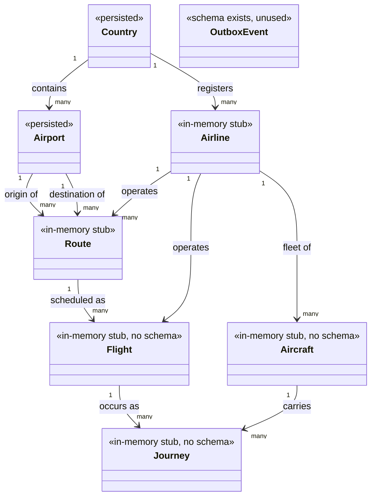

# aero-hex-ai — Domain Model (Static View)

> Source of truth for this document is the code: `domain/`, `application/`, `shared-kernel/`,
> `adapter-http/` (DTO validators), and `infrastructure/migration/` (Flyway schema). Aviation
> concept definitions are adapted from `../incubator/README.adoc` (`=== Model` section), a prior
> research project by the same author covering the same domain. Every rule is traced to a file and
> line; anything not explicit in code is marked `[ASSUMPTION]`, and anything documented/implied but
> not actually enforced is marked `[MISSING]`.

## 1. Ubiquitous Language / Glossary

| Term | Definition |
|---|---|
| Country | A nation with its own government, occupying a particular territory. Identified by a two-letter code. (adapted from `../incubator/README.adoc`) |
| Airport | A complex of runways and buildings for the take-off, landing, and maintenance of civil aircraft, with facilities for passengers. Belongs to one Country. (adapted from `../incubator/README.adoc`) |
| Airline | An organization providing a regular public service of air transport on one or more routes. Belongs to one Country of registration. (adapted from `../incubator/README.adoc`) |
| Aircraft | An airplane capable of flight to transport people and cargo. Belongs to one Airline. (adapted from `../incubator/README.adoc`) |
| Route | A way or course taken in getting from a starting point (Airport) to a destination (Airport), operated by an Airline. (adapted from `../incubator/README.adoc`) |
| Flight | A timetabled journey made by an airline, running along a Route on a schedule. (adapted from `../incubator/README.adoc`) — modeled in code but **not yet backed by any database table** ([MISSING], see §7). |
| Journey | An actual, dated occurrence of a Flight: a single act of travelling that takes place inside a specific Aircraft. (adapted from `../incubator/README.adoc`) — modeled in code but **not yet backed by any database table** ([MISSING], see §7). |
| IATA Code | The 3-letter alphabetic code assigned by the International Air Transport Association identifying an Airport (e.g. `MAD`). |
| ICAO Code | The alphabetic code assigned by the International Civil Aviation Organization. Used for two *different* concepts at two *different* lengths in this codebase: a 4-letter Airport code (e.g. `LEMD`) and a 3-letter Airline code (e.g. `AEA`) — see BR-03/§6. |
| Country Code | ISO 3166-1 alpha-2 code identifying a Country (e.g. `ES`). |
| Registration | The international code identifying a specific physical Aircraft (e.g. `EC-MIG`). |
| Outbox Event | A durable record of a domain event pending publication to Kafka, part of the transactional outbox pattern (`domain/model/OutboxEvent.scala`). |
| Pagination | A `(page, pageSize)` request shape shared by every list endpoint (`shared-kernel/Pagination.scala`). |

## 2. Bounded Context

**Name:** Aviation Network (reference/master data + route network for an airline network — countries,
airports, airlines, aircraft, routes, and the flights/journeys that run on them).

**Explicitly out of scope** (no model, no port, no endpoint references any of these anywhere in the
codebase):
- Ticketing, pricing, fare rules, seat inventory
- Passenger identity, booking, check-in, boarding
- Crew rostering / duty-time management
- Baggage handling
- Loyalty / frequent-flyer programs
- Real-time flight tracking / ATC data
- Scheduling *optimization* (the model records a schedule, `Flight.schedDeparture`/`schedArrival`, but
  does not compute or validate one)

## 3. Conceptual Domain Model

Stereotypes mark actual wiring status (`bootstrap/WiringModule.scala`), not aspirational design:
`<<persisted>>` = real Postgres via Quill; `<<in-memory stub>>` = `ZLayer.succeed` with no-op
save/delete; `<<schema exists, unused>>` = Flyway table present but nothing writes to it from the
application layer yet.

## 4. Entities and Value Objects

| Name | Kind | Identity | Key Attributes & Invariants | Module / File |
|---|---|---|---|---|
| `Country` | Entity (Aggregate Root) | `CountryCode` (natural key) | `code: CountryCode`, `name: String` (no blank check in the domain type itself) | `domain/model/Country.scala` |
| `CountryCode` | Value Object (opaque `String`) | — | `apply` performs no validation; a validating `from` smart constructor exists (`length == 2 && forall(_.isLetter)`) but is **dead code** — never called anywhere outside its own file (§7) | `domain/model/Country.scala:1-10` |
| `Airport` | Entity (Aggregate Root) | `IataCode` (natural key) | `iataCode: IataCode`, `icaoCode: String` (raw, not opaque — inconsistent with `IataCode`/`IcaoCode`), `name`, `city`, `countryCode: CountryCode` (FK) | `domain/model/Airport.scala` |
| `IataCode` | Value Object (opaque `String`) | — | No format validation in the type itself; format enforced only at the HTTP boundary (§5 BR-02) | `domain/model/Airport.scala:1-8` |
| `Airline` | Entity (Aggregate Root) | `IcaoCode` (natural key) | `icao: IcaoCode`, `name`, `foundationDate: LocalDate`, `countryCode: CountryCode` (FK) | `domain/model/Airline.scala` |
| `IcaoCode` | Value Object (opaque `String`) | — | No format validation anywhere (no Airline HTTP write endpoints exist to validate against) | `domain/model/Airline.scala:1-8` |
| `Aircraft` | Entity | `Registration` (natural key) | `registration: Registration`, `typeCode: String`, `airlineIcao: IcaoCode` (FK) | `domain/model/Aircraft.scala` |
| `Registration` | Value Object (opaque `String`) | — | No format validation | `domain/model/Aircraft.scala:1-8` |
| `Route` | Entity (Aggregate Root) | `RouteId` (UUID, surrogate) | `origin`/`destination: IataCode` (FK, must differ — BR-07), `airlineIcao: IcaoCode` (FK), `distanceKm: Int` (must be positive — BR-08) | `domain/model/Route.scala` |
| `RouteId` | Value Object (opaque `UUID`) | — | `generate` factory produces a fresh random UUID | `domain/model/Route.scala:5-11` |
| `Flight` | Entity | `FlightCode` (natural key) | `code: FlightCode`, `alias: Option[String]`, `schedDeparture`/`schedArrival: LocalTime`, `routeId: RouteId` (FK), `airlineIcao: IcaoCode` (FK — see §7 for possible redundancy with `Route`'s airline) | `domain/model/Flight.scala` |
| `FlightCode` | Value Object (opaque `String`) | — | No format validation | `domain/model/Flight.scala:1-10` |
| `Journey` | Entity | `JourneyId` (UUID, surrogate) | `departureDate`/`arrivalDate: LocalDateTime`, `flightCode: FlightCode` (FK), `registration: Registration` (FK) | `domain/model/Journey.scala` |
| `JourneyId` | Value Object (opaque `UUID`) | — | `generate` factory | `domain/model/Journey.scala:6-12` |
| `OutboxEvent` | Entity | `OutboxEventId` (UUID) | `aggregateType`/`aggregateId`/`eventType`/`payload: String` (JSON serialized as plain `String`, stored as `JSONB`), `published: Boolean` | `domain/model/OutboxEvent.scala` |
| `Pagination` | Value Object | — | `page`/`pageSize`; **smart-constructor clamps rather than rejects**: `page` floors to 1, `pageSize` clamps to `[1, 100]` (silent correction, not a validation error) | `shared-kernel/Pagination.scala` |
| `NonEmptyString` | Value Object (opaque `String`) | — | Validating `from`/`unsafeFrom` exist (rejects blank/all-whitespace) but the type is **entirely unused** — no domain model field anywhere has this type (§7) | `shared-kernel/NonEmptyString.scala` |

## 5. Business Rules

| ID | Rule | Enforcement |
|---|---|---|
| BR-01 | A country code is exactly 2 alphabetic characters (ISO 3166-1 alpha-2). | HTTP layer only: `Validator.pattern("[a-zA-Z]{2}")` in `adapter-http/.../endpoint/CountryEndpoints.scala:18-20`, `AirportEndpoints.scala:18-20`, and DTO validators in `CreateCountryRequest`/`CreateAirportRequest`/`UpdateAirportRequest` (`adapter-http/.../dto/CountryDto.scala`, `AirportDto.scala`). **[MISSING at domain layer]** — `CountryCode.from` (`domain/model/Country.scala:7`) implements this exact check but is never invoked; `CountryCode.apply` used everywhere performs no validation. |
| BR-02 | An IATA airport code is exactly 3 alphabetic characters. | HTTP layer only: `AirportEndpoints.scala:26-28` (path param), `AirportDto.scala` (`CreateAirportRequest`/`AirportDto`), `RouteDto.scala` (`originIata`/`destinationIata`). No domain-level smart constructor exists for `IataCode` at all. |
| BR-03 | ICAO code length differs by entity: Airport ICAO codes are 4 letters; Airline ICAO codes are 3 letters. | Airport: enforced at HTTP layer, `AirportDto.scala:27-31,63-68,100-105` (`Validator.minLength/maxLength(4)` + alpha pattern on create/update). Airline: **not enforced anywhere** — no Airline write endpoints exist (Airline is find-only, see CLAUDE.md API table), so the 3-letter shape is only implied by `RouteDto`'s `airlineIcao` validator (`RouteDto.scala:38-42`) and by the `icao_code VARCHAR(3)` column (`V3__create_airlines.sql`). |
| BR-04 | An Airport's Country must already exist (referential integrity). | Enforced twice: application-observable via `QuillAirportRepository.resolveCountryId` → `DomainError.CountryNotFound` (`infrastructure/persistence-quill/.../QuillAirportRepository.scala:36-45`), and at the DB level via FK `airports.country_id → countries.id` (`V7__add_surrogate_keys.sql`). |
| BR-05 | An Airport's IATA code must be unique. | Application pre-check in `CreateAirportService.create` (`findByIata` → fail `AirportAlreadyExists` if present, `application/.../CreateAirportService.scala:12-15`), *and* DB `UNIQUE` on `airports.iata_code` with SQLState `23505` mapped back to `AirportAlreadyExists` in `QuillAirportRepository.save` (`infrastructure/persistence-quill/.../QuillAirportRepository.scala:108-124`). |
| BR-06 | A Country's code must be unique. | Same double-enforcement pattern as BR-05: `CreateCountryService.create` (`application/.../CreateCountryService.scala:12-14`) + DB `UNIQUE` on `countries.code` with SQLState mapping in `QuillCountryRepository`. |
| BR-07 | A Route's origin and destination airports must differ. | `RouteValidator.validate` (`domain/service/RouteValidator.scala:12-13`) → `DomainError.InvalidRoute`. |
| BR-08 | A Route's distance must be a positive number. | `RouteValidator.validate` (`domain/service/RouteValidator.scala:14-15`) → `InvalidRoute`; also DB `CHECK (distance_km > 0)` (`V4__create_routes.sql`). Note unit mismatch with the incubator source's "nautical miles" description — see §7. |
| BR-09 | Both airports referenced by a new Route must already exist. | `CreateRouteService.resolveAirport` (`application/.../CreateRouteService.scala:29-33`) → `AirportNotFound` for either endpoint. |
| BR-10 | A (origin, destination, airline) route segment should be unique — no duplicate routes for the same airline pair. | Documented but **not enforced in the running application** `[MISSING]`. The intent is real: DB `UNIQUE (origin_airport_id, destination_airport_id, airline_id)` exists (`V7__add_surrogate_keys.sql`, originally `uq_route_segment` in `V4`), `DomainError.RouteAlreadyExists` exists (`domain/error/DomainError.scala:12`), and `RouteEndpoints.create` documents a 409 conflict variant (`adapter-http/.../RouteEndpoints.scala`). But `RouteRepository` is wired to an unconditional in-memory stub (`bootstrap/WiringModule.scala:37-43`, `save` always `ZIO.succeed(r)`), so the constraint is currently unreachable from the API — the documented 409 can never actually fire. |
| BR-11 | Name-search queries (Country, Airport) must be at least 3 characters. | HTTP layer only: `AirportEndpoints.searchByName` (`Validator.minLength(3)`, `adapter-http/.../AirportEndpoints.scala:64`), `CountryEndpoints` (`validateOption(Validator.minLength(3))`, line 49). |
| BR-12 | List pagination: `page ≥ 1`; `pageSize` between 1 and 100. | Enforced inconsistently. `Pagination.apply` (`shared-kernel/Pagination.scala:9-10`) always *clamps* silently rather than rejecting. Some endpoints additionally reject out-of-range values at the HTTP layer with `Validator.min/max` (`AirportEndpoints.findByCountry`, `CountryEndpoints.findAll`) — but `AirportEndpoints.findAll`'s own `page`/`pageSize` query params carry **no validator at all** (`AirportEndpoints.scala:48-49`), relying solely on the silent domain-level clamp. `[ASSUMPTION]` whether silent clamping vs. HTTP 400 rejection is the intended behavior for every endpoint. |
| BR-13 | Every domain-level mutation (e.g. Route creation) should durably record an event for downstream publication (outbox pattern). | **[MISSING]** — `CreateRouteService` does not write to `outbox_events` (confirmed: no `OutboxRepository` dependency in `CreateRouteService`, `application/.../CreateRouteService.scala`); `OutboxRelay` exists in `messaging-kafka` but is not wired into `Main` (per `CLAUDE.md`). |
| BR-14 | Country/Airport/Airline names, Airport city, must not be blank. | Enforced only at the HTTP write boundary via `Validator.minLength(1)` on create/update DTOs (`CountryDto.scala`, `AirportDto.scala`) — **not** in the domain model itself. `NonEmptyString` (`shared-kernel/NonEmptyString.scala`) was built for exactly this purpose but is unused (`[MISSING]`/dead code, see §7). |

## 6. Constraints

| Concern | Constraint | Source |
|---|---|---|
| Country code | 2 alphabetic chars, ISO 3166-1 alpha-2 | `V1__create_countries.sql` (`VARCHAR(2)`), HTTP validators |
| Airport IATA code | 3 alphabetic chars | `V2__create_airports.sql` (`VARCHAR(3)`), HTTP validators |
| Airport ICAO code | 4 alphabetic chars | `V6__add_airport_icao_code.sql` (`VARCHAR(4)`), HTTP validators |
| Airline ICAO code | 3 chars (column length only; no alpha pattern anywhere) | `V3__create_airlines.sql` (`VARCHAR(3)`) |
| Country/Airport/Airline name | ≤ 100/200/200 chars respectively; non-blank at HTTP layer only | `V1`/`V2`/`V3` migrations, DTO validators |
| Route distance | Positive integer, unit is **kilometres** per code (`distanceKm`, `RouteDto` description "Flight distance in kilometres") | `domain/model/Route.scala`, `V4__create_routes.sql` (`CHECK (distance_km > 0)`) — see §7 for a unit discrepancy against the incubator source, which describes the equivalent field in nautical miles |
| Route/Journey/OutboxEvent identifiers | UUID, app-generated (`RouteId.generate`, `JourneyId.generate`, `OutboxEventId.generate`) | `domain/model/Route.scala`, `Journey.scala`, `OutboxEvent.scala` |
| Country/Airport/Airline identifiers (persistence) | Surrogate `BIGINT GENERATED ALWAYS AS IDENTITY`, natural key kept as `UNIQUE NOT NULL` | `V7__add_surrogate_keys.sql` |
| Pagination | `page ≥ 1`, `1 ≤ pageSize ≤ 100` (see BR-12 for enforcement gaps) | `shared-kernel/Pagination.scala` |
| Name search | Minimum 3 characters | `AirportEndpoints.scala`, `CountryEndpoints.scala` |
| Audit timestamps | `created_at`/`updated_at TIMESTAMPTZ NOT NULL DEFAULT NOW()` exist on `countries`, `airports`, `airlines`, `routes` | `V1`–`V4` migrations — **not modeled in the domain layer at all**; no domain case class exposes these fields, so they're persistence-only bookkeeping |

## 7. Open Questions

1. **Route distance unit mismatch.** The incubator source (`../incubator/README.adoc`) describes the
   equivalent field as "*number of nautical miles between the two Airports*", but this codebase's
   field is named `distanceKm` and its OpenAPI description says "kilometres" (`RouteDto.scala`). Which
   is correct for this project — was this a deliberate unit change, or should the glossary/API text be
   corrected? `[ASSUMPTION: kilometres, per the current code]`
2. **`RouteAlreadyExists` / route-segment uniqueness (BR-10) is fully unenforced in the running app**
   because `RouteRepository` is an in-memory stub. Is this an acknowledged gap awaiting real Route
   persistence, or should the duplicate-check be added to `CreateRouteService` regardless of backing
   store (defense in depth)?
3. **`Flight.airlineIcao` vs. `Route.airlineIcao`.** A `Flight` carries its own `airlineIcao` in
   addition to a `routeId` that already resolves to a `Route` with its own `airlineIcao`. Should these
   always agree (codeshare aside)? No validation ties them together today, and there's no code path
   that even creates a `Flight` (`FindFlightUseCase` is read-only, no `CreateFlightUseCase` exists).
4. **`CountryCode.from` and `NonEmptyString` are dead code.** Both implement real validation logic
   (2-letter alpha check; non-blank check) that mirrors rules enforced only at the HTTP layer today.
   Should domain-level smart constructors become the actual enforcement point (defense in depth against
   any future non-HTTP caller), or should the unused code be removed as noise?
5. **Aircraft, Flight, Journey have no Flyway schema at all** (migrations `V1`–`V7` cover only
   `countries`, `airports`, `airlines`, `routes`, `outbox_events`). They exist purely as domain models
   + in-memory stubs. Is a schema for these planned, or are they deliberately out of scope until a
   later phase?
6. **Airline has no write use cases** (`FindAirlineUseCase` only) despite `CreateAirlineUseCase`-shaped
   symmetry with Country/Airport. Is Airline creation intentionally deferred, or a gap to close before
   Route creation can be meaningfully tested end-to-end (Route creation depends on Airport, and
   implicitly on Airline via `airlineIcao`, but never validates the Airline exists — see BR-09, which
   only resolves airports, not the airline)?
7. **Pagination validation is inconsistent across endpoints** (BR-12) — some reject out-of-range
   `page`/`pageSize` with HTTP 400, others silently clamp via `Pagination.apply`. Should every
   list endpoint validate identically?
