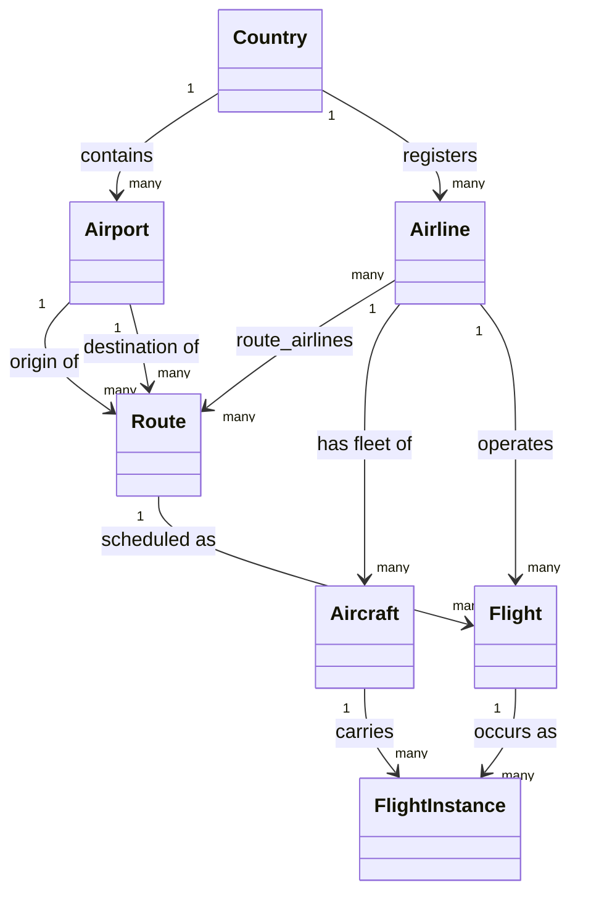

# aero-hex-ai — Entity Relationship Draft (Working Doc)

> **Status: DRAFT / working notes.** This is not a source of truth — it's a scratch space for
> reviewing and refining entity relationships before any conclusion gets promoted into
> `01-domain-model.md`. Entity and value-object **definitions** (kind, identity, attributes) live
> in `01-domain-model.md` §4 and are not repeated here — this doc only reasons about the *edges*
> between them: who relates to whom, in which direction, at what cardinality, and under what name.
>
> **Coverage: all seven entities.** `Country`, `Airport`, `Airline`, `Route`, `Flight`,
> `Aircraft`, and `FlightInstance` each have a chapter below. `OutboxEvent` is excluded throughout
> — it references its subject generically, not via a typed FK to any specific entity, so it
> doesn't belong in this relationship graph.

## 1. Entity relationship diagram

One diagram for the whole doc, assembled from every chapter below (§2.1–§2.7) — not one diagram
per chapter.

## 2. Entity relationship chapters

One chapter per entity: a table of its relationships to every neighboring entity. Relationship
names reuse this project's own established vocabulary — the same labels `01-domain-model.md`'s
diagram used before an earlier pass simplified it down to bare names + cardinality.

**Criterion — direct relationships only.** A relationship is listed for an entity only if it's
backed by a direct FK-shaped reference in the domain model (an opaque-typed field pointing at
another entity's identifier). If an entity is only reachable *through* another one already in the
table, it's left out — keeping the model simple and avoiding denormalized/derivable edges. Each
chapter notes what's reachable only transitively, so it's clear the omission was deliberate, not
missed.

**Common queries — deduplication, parent wins.** Every relationship shows up in *both* entities'
chapters (e.g. Country↔Airport appears in §2.1 and §2.2), but each query pair (X→Y and its
inverse Y→X) is listed only once: in whichever entity is the **parent** — the `1` side of that
relationship's `1 → many` edge. The child's chapter instead points back to the parent's chapter
rather than repeating the same SQL. This applies recursively down the graph: `Airport` is
`Country`'s child but `Route`'s parent, so §2.2 keeps the Airport↔Route queries (parent there)
while pointing to §2.1 for the Country↔Airport queries (child there). Avoids the same SQL being
maintained in two places and drifting out of sync.

### 2.1 Country

Root of the graph — every other entity reaches `Country` only transitively through `Airport` or
`Airline`; nothing reaches it directly.

| Related entity | Direction | Cardinality | Relationship |
|----------------|-----------|-------------|--------------|
| Airport        | outgoing  | 1 → many    | contains     |
| Airline        | outgoing  | 1 → many    | registers    |

Common queries, against the current (post-`V7`) surrogate-key schema:

| Query                                       | SQL                                                                                             |
|---------------------------------------------|-------------------------------------------------------------------------------------------------|
| Get all airports in a country               | `SELECT a.* FROM airports a JOIN countries c ON a.country_id = c.id WHERE c.code = 'ES';`       |
| Get the country for an airport              | `SELECT c.* FROM countries c JOIN airports a ON a.country_id = c.id WHERE a.iata_code = 'MAD';` |
| Get all airlines registered in a country    | `SELECT l.* FROM airlines l JOIN countries c ON l.country_id = c.id WHERE c.code = 'ES';`       |
| Get the country an airline is registered in | `SELECT c.* FROM countries c JOIN airlines l ON l.country_id = c.id WHERE l.icao_code = 'IBE';` |

Considered and excluded as transitive: `Aircraft` — reachable only via `Airline`
(`Aircraft.airlineIcao → Airline.countryCode`), not a direct relationship on `Country` itself. No
functional justification found to break the direct-relationships-only criterion for it at this
time.

### 2.2 Airport

Belongs to one `Country`; every `Route` references it twice, independently, as origin and as
destination (`Route.origin`, `Route.destination` — the only FK-shaped references to `IataCode`
in the model; the type's only other use is `Airport.iataCode`, its own identity).

| Related entity | Direction | Cardinality | Relationship   |
|----------------|-----------|-------------|----------------|
| Country        | incoming  | many → 1    | contained by   |
| Route          | outgoing  | 1 → many    | origin of      |
| Route          | outgoing  | 1 → many    | destination of |

Common queries, against the current (post-`V7`) surrogate-key schema. `Airport` is `Country`'s
child, so the Country↔Airport pair is kept once at the parent — see §2.1:

| Query                                    | SQL                                                                                                        |
|------------------------------------------|------------------------------------------------------------------------------------------------------------|
| Get all routes originating at an airport | `SELECT r.* FROM routes r JOIN airports a ON r.origin_airport_id = a.id WHERE a.iata_code = 'MAD';`        |
| Get the origin airport for a route       | `SELECT a.* FROM airports a JOIN routes r ON r.origin_airport_id = a.id WHERE r.id = '<route-uuid>';`      |
| Get all routes arriving at an airport    | `SELECT r.* FROM routes r JOIN airports a ON r.destination_airport_id = a.id WHERE a.iata_code = 'MAD';`   |
| Get the destination airport for a route  | `SELECT a.* FROM airports a JOIN routes r ON r.destination_airport_id = a.id WHERE r.id = '<route-uuid>';` |

Considered and excluded as transitive: `Airline` — reachable only via `Route`
(`Airport → Route.airlineIcao → Airline`), two hops removed; no direct field on `Airport` or
`Route`'s airport fields references it.

### 2.3 Airline

Belongs to one `Country`; three entities reference it independently by `IcaoCode` — `Route`,
`Aircraft`, and `Flight` — each with its own `airlineIcao` field.

| Related entity | Direction | Cardinality | Relationship  |
|----------------|-----------|-------------|---------------|
| Country        | incoming  | many → 1    | registered in |
| Route          | outgoing  | 1 → many    | operates      |
| Aircraft       | outgoing  | 1 → many    | has fleet of  |
| Flight         | outgoing  | 1 → many    | operates      |

Common queries, against the current (post-`V7`) surrogate-key schema. `Airline` is `Country`'s
child, so the Country↔Airline pair is kept once at the parent — see §2.1:

| Query                                       | SQL                                                                                             |
|---------------------------------------------|-------------------------------------------------------------------------------------------------|
| Get all routes operated by an airline       | `SELECT r.* FROM routes r JOIN airlines l ON r.airline_id = l.id WHERE l.icao_code = 'IBE';`    |
| Get the airline operating a route           | `SELECT l.* FROM airlines l JOIN routes r ON r.airline_id = l.id WHERE r.id = '<route-uuid>';`  |

No SQL for the `Aircraft` or `Flight` relationships: neither has a Flyway table at all (only
`countries`, `airports`, `airlines`, `routes`, `outbox_events` exist — see `01-domain-model.md`
Open Question 5), so those two edges are domain-model-only today.

Considered and excluded as transitive: `Airport` — reachable only via `Route`
(`Airline → Route.origin`/`Route.destination → Airport`), two hops removed; no direct field on
`Airline` references it.

### 2.4 Route

The hub entity: the only one referencing two other entities' identifiers three times over
(`origin: IataCode`, `destination: IataCode`, `airlineIcao: IcaoCode`), plus one entity
(`Flight`) referencing it back.

| Related entity | Direction | Cardinality | Relationship    |
|----------------|-----------|-------------|-----------------|
| Airport        | incoming  | many → 1    | originates from |
| Airport        | incoming  | many → 1    | terminates at   |
| Airline        | incoming  | many → 1    | operated by     |
| Flight         | outgoing  | 1 → many    | scheduled as    |

Common queries, against the current (post-`V7`) surrogate-key schema. `Route` is the child in
both its `Airport` and `Airline` relationships, so those query pairs are kept once at the
parent — origin/destination-airport queries at §2.2, operating-airline queries at §2.3. Only the
one query with no parent chapter to own it (it spans all three relationships at once) stays here:

| Query                                    | SQL                                                                                                                                                                                                                                                                                   |
|------------------------------------------|---------------------------------------------------------------------------------------------------------------------------------------------------------------------------------------------------------------------------------------------------------------------------------------|
| Get the countries joined by a route      | `SELECT DISTINCT c.* FROM routes r JOIN airports ao ON r.origin_airport_id = ao.id JOIN airports ad ON r.destination_airport_id = ad.id JOIN airlines l ON r.airline_id = l.id JOIN countries c ON c.id IN (ao.country_id, ad.country_id, l.country_id) WHERE r.id = '<route-uuid>';` |

No SQL for the `Flight` relationship: `Flight` has no Flyway table (see §2.3's note), so it's
domain-model-only today.

Considered and excluded as transitive: `Country` — reachable via **two independent paths**,
`Route → Airport → Country` and `Route → Airline → Country`, neither backed by a direct field on
`Route` itself. Worth flagging on its own: unlike every other chapter's single transitive path,
these two paths aren't guaranteed to agree (a route's origin/destination airports and its
operating airline could, in principle, belong to different countries — that's the normal case for
an international route) — so "the route's country" isn't even a well-defined single value, which
is a good reason *not* to try collapsing it into one derived relationship.

### 2.5 Flight

Neither persisted (no Flyway table) nor creatable (`FindFlightUseCase` is read-only, no
`CreateFlightUseCase` exists) — every relationship below is domain-model-only today.

| Related entity | Direction | Cardinality | Relationship |
|---|---|---|---|
| Route | incoming | many → 1 | scheduled on |
| Airline | incoming | many → 1 | operated by |
| FlightInstance | outgoing | 1 → many | occurs as |

Common queries — same shape as every other chapter, but `flights` has no Flyway table (see
§2.3/§2.4's notes and `01-domain-model.md` Open Question 5), so the SQL column is a placeholder
until that gap closes. `Flight` is the parent in its `FlightInstance` relationship, so the last
two rows below are kept here rather than duplicated at §2.7:

| Query | SQL |
|---|---|
| Get the route a flight is scheduled on | `TODO — flights has no Flyway table yet` |
| Get all flights scheduled on a route | `TODO — flights has no Flyway table yet` |
| Get the airline operating a flight | `TODO — flights has no Flyway table yet` |
| Get all flights operated by an airline | `TODO — flights has no Flyway table yet` |
| Get all flight instances of a flight | `TODO — flights has no Flyway table yet` |
| Get the flight a flight instance occurs on | `TODO — flights has no Flyway table yet` |

Considered and excluded as transitive: `Airport` — reachable via `Route`
(`Flight → Route.origin`/`Route.destination → Airport`), two hops removed. `Country` is
reachable via **three** separate paths now — `Route → Airport`, `Route → Airline`, and directly
via `Flight → Airline` — reinforcing §2.4's point that "the country" isn't a single well-defined
value for anything downstream of `Route`.

### 2.6 Aircraft

Neither persisted (no Flyway table) nor mutable beyond find (`FindAircraftUseCase` is read-only,
`AircraftRepository` is an in-memory stub) — like `Flight`, every relationship below is
domain-model-only today.

| Related entity | Direction | Cardinality | Relationship |
|---|---|---|---|
| Airline | incoming | many → 1 | belongs to fleet of |
| FlightInstance | outgoing | 1 → many | carries |

Common queries — placeholders, same reason as §2.5: no `aircraft` table exists yet. `Aircraft` is
the parent in its `FlightInstance` relationship, so the last two rows below are kept here rather
than duplicated at §2.7:

| Query | SQL |
|---|---|
| Get the airline an aircraft belongs to | `TODO — aircraft has no Flyway table yet` |
| Get all aircraft in an airline's fleet | `TODO — aircraft has no Flyway table yet` |
| Get all flight instances carried by an aircraft | `TODO — aircraft has no Flyway table yet` |
| Get the aircraft that carried a flight instance | `TODO — aircraft has no Flyway table yet` |

Considered and excluded as transitive: `Country` — reachable via `Airline`
(`Aircraft.airlineIcao → Airline.countryCode`), two hops removed (same shape as §2.1's note, from
the other side). `Flight` is reachable via `FlightInstance`
(`Aircraft → FlightInstance.flightCode → Flight`), also two hops removed, and from there `Route`
and — again — `Country` via any of the paths already catalogued in §2.4/§2.5.

### 2.7 FlightInstance

The leaf of the graph: nothing references `FlightInstanceId`, so it has no outgoing relationship
at all — only the two incoming edges already introduced in §2.5 and §2.6. Neither persisted (no
Flyway table) nor creatable (no `CreateFlightInstanceUseCase` exists).

| Related entity | Direction | Cardinality | Relationship |
|---|---|---|---|
| Flight | incoming | many → 1 | occurrence of |
| Aircraft | incoming | many → 1 | carried by |

No common-queries table here: `FlightInstance` is the child in both of its relationships
(`Flight` and `Aircraft`), so both query pairs are kept once at their parent — see §2.5 for the
Flight↔FlightInstance pair, §2.6 for the Aircraft↔FlightInstance pair.

Considered and excluded as transitive: everything else in the graph. `Route` and `Airline` (via
`Flight`), `Airline` again (via `Aircraft`), `Airport` (via `Flight → Route`), and `Country`
(reachable via **four** separate paths at this point — `Flight → Route → Airport`,
`Flight → Route → Airline`, `Flight → Airline`, and `Aircraft → Airline` — none guaranteed to
agree). `FlightInstance` inherits the full ambiguity flagged starting at §2.4, which is the
strongest argument in the whole doc for leaving "country" undefined at this level rather than
picking one of the four paths arbitrarily.

---

Cross-cutting analysis — the recurring `Country`-ambiguity pattern, the
`Aircraft`/`Flight`/`FlightInstance` persistence gap, business rules implied by the edges, and
anything else that only shows up once every chapter is compared side by side — belongs in a
follow-up section once this per-entity shape is confirmed to be the right one.
