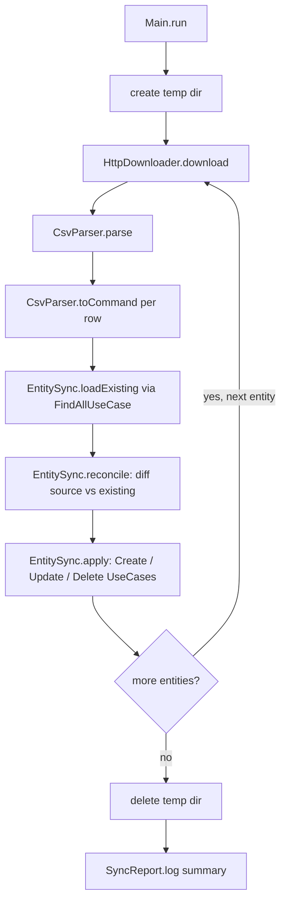
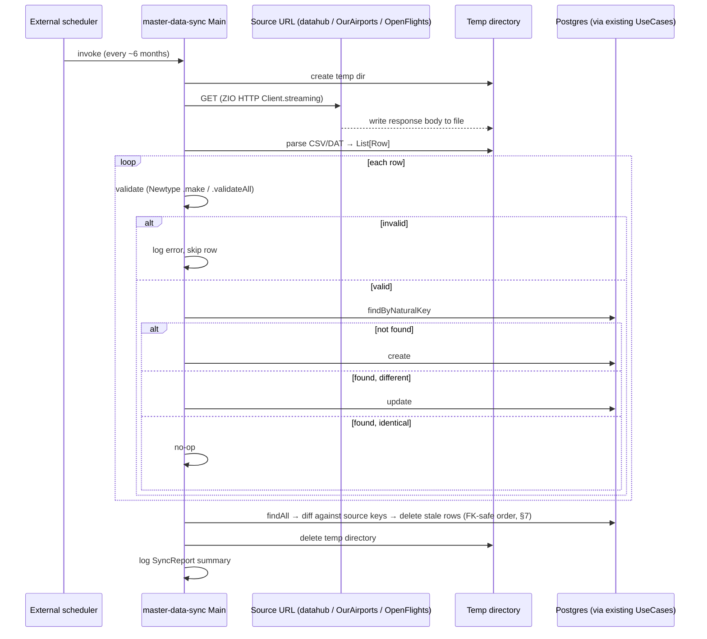

# Master Data Management — Download & Sync for Country / Airport / Airline

> **Status:** Analysis — architecture decided; implementation started. `Main` downloads the Country
> source into a temp dir, parses all 249 real rows (including all 4 quoted-comma edge cases), and
> builds a valid `CreateCountryCommand` for every one of them, then cleans up — temp-dir lifecycle,
> `HttpDownloader`, and `CountryCsvParser.parse`/`.toCommand` are all implemented and verified against
> the live source. See `plans/masterdata/master-data-sync-scaffold.md`,
> `plans/masterdata/http-downloader-country.md`, and `plans/masterdata/country-csv-parser.md`.
> Actually persisting a command (`CreateCountryService`), reconciliation, and Airport/Airline
> downloads/parsing are still design-only.
> Covers data source selection, sync architecture, reconciliation algorithm, validation/error
> handling, and open decisions for a low-frequency (~6-month) external master-data refresh.

---

## 1. Goal & scope

Countries, Airports, and Airlines are reference/master data — external, changing rarely (a few times a
year at most: new airports open, airlines rebrand or cease operating, country codes are essentially
static). This project currently seeds them by hand (`plans/seed-data-*.sql`, a one-time manual import)
or via each entity's own CRUD API, one row at a time. The goal is a repeatable process that:

1. Downloads the current authoritative list for each entity to a temporary directory.
2. Reconciles it against what's stored, so the downloaded list becomes that entity's single source of
   truth: rows present only in the source are created, rows present in both with different values are
   updated, rows present locally but absent from the source are deleted.
3. Validates every row and logs errors/issues without aborting the whole run.
4. Deletes the temporary directory when done.
5. Repeats on a ~6-month cadence.

**In scope:** Country, Airport, Airline — matches what was asked for explicitly.

**Out of scope:** Aircraft (registrations) and Route. Both are operational data created by an airline
through the app's own API (a specific tail number, a specific city pair an airline decides to fly),
not externally-authoritative reference data with a natural "master list" to sync against.

---

## 2. Data sources

### 2.1 Country — selected

**Source:** `https://datahub.io/core/country-list/_r/-/data.csv`
(redirects to `r2.datahub.io/.../data.csv`).

Confirmed by fetch: 249 data rows, two columns (`Name,Code`) — matching the 249 ISO 3166-1 alpha-2
codes already seeded into `country_codes` by `V12__create_country_codes.sql`.

```csv
Name,Code
Afghanistan,AF
Albania,AL
Algeria,DZ
...
"Bonaire, Sint Eustatius and Saba",BQ
"Palestine, State of",PS
"Saint Helena, Ascension and Tristan da Cunha",SH
"Tanzania, the United Republic of",TZ
```

4 of the 249 rows contain a comma inside a quoted `Name` field, so a plain `split(",")` would corrupt
them — but rather than pull in the `scala-csv` dependency (§4.2, reserved for Airport/Airline's larger,
more irregular files) for a fixed two-column format this simple, **Country parsing is a single regex
per line, not a library call:**

```
^(?:"([^"]+)"|([^,]+)),([A-Za-z]{2})$
```

Group 1 or 2 is the name (quoted-with-comma vs. plain), group 3 is the code — anchored so the code
must be exactly 2 letters, which also means the header line (`Name,Code` — `Code` is 4 letters) simply
fails to match and is skipped explicitly by line number, not logged as a parse error (an expected line,
not a data problem). **Decided:** every line after the header that fails to match this pattern is a
tolerated parse error — logged with the raw line, then skipped, same as a domain-validation failure
(§8) — never aborts the rest of the file.

| Column | Domain mapping |
|---|---|
| `Code` | `Country.code` (`CountryCode`) |
| `Name` | `Country.name` |

Underlying dataset is `datasets/country-list` on GitHub, same public-domain-family lineage as the rest
of the `datasets/*` collection on datahub.io — no attribution requirement.

### 2.2 Airport — selected

**Source:** OurAirports `airports.csv` (`https://ourairports.com/data/airports.csv`) — licensed
**Open Data Commons Public Domain Dedication and License v1.0 (PDDL)**, fully public domain, no
attribution required. Regenerated daily (a GitHub mirror also exists at
`davidmegginson.github.io/ourairports-data/airports.csv`, but the canonical source is the site
itself).

| Column | Domain mapping | Notes |
|---|---|---|
| `iata_code` | `Airport.iataCode` | **Filter**: skip rows with a blank `iata_code` — most of the ~80k rows (heliports, closed strips, ultralight fields) have none |
| `ident` | `Airport.icaoCode` | OurAirports' `ident` is the ICAO code for most entries but falls back to a locally-generated code for airports without one; **filter**: keep only rows matching `AirportIcaoCode`'s `^[A-Za-z]{4}$` shape, log+skip the rest |
| `name` | `Airport.name` | |
| `municipality` | `Airport.city` | |
| `iso_country` | Country relationship (`AirportRepository.save`'s separate `countryCode` param) | Already ISO 3166-1 alpha-2, same code space as `Country.code` |
| `type` | Row filter, not persisted | See §9 — recommend keeping only `large_airport`/`medium_airport` (reliable IATA coverage); full enum: `balloonport`, `closed_airport`, `heliport`, `large_airport`, `medium_airport`, `seaplane_base`, `small_airport` |

### 2.3 Airline — selected, with caveats

**Source:** OpenFlights `airlines.dat`, repo `github.com/jpatokal/openflights` → `data/airlines.dat`.
Raw download URL for programmatic fetch: `https://raw.githubusercontent.com/jpatokal/openflights/master/data/airlines.dat`
(the `github.com/.../blob/...` form is the HTML viewer page, not fetchable as a plain file). No header
row, 8 comma-separated columns, `\N` marks a null field:

| # | Column | Domain mapping | Notes |
|---|---|---|---|
| 1 | Airline ID | — | OpenFlights' own surrogate id, not used |
| 2 | Name | `Airline.name` | |
| 3 | Alias | — | not modeled |
| 4 | IATA | — | not modeled (`Airline` has no IATA-code field, only ICAO) |
| 5 | ICAO | `Airline.icao` (`AirlineIcaoCode`) | **Filter**: skip blank/`\N` |
| 6 | Callsign | — | not modeled |
| 7 | Country | Country relationship | **Gap** — free-text country *name* (e.g. `"Spain"`), not an ISO code; needs a name→`CountryCode` lookup, inherently fragile across name variants (`"United States"` vs `"United States of America"`) |
| 8 | Active (`Y`/`N`) | Row filter | Recommend keeping only `Active = Y` |

**Two structural gaps found during research, not just filtering concerns:**

- **No founding-date column.** `Airline.foundationDate: LocalDate` is `NOT NULL` in both the schema
  (`V9__add_airline_foundation_date.sql`) and the domain model — OpenFlights has nothing to fill it
  with.
- **Stale, community-maintained snapshot.** OpenFlights' own documentation describes the GitHub copy
  as "only a sporadically updated static snapshot of the live OpenFlights database" — no fixed refresh
  cadence. Licensed **ODbL + DbCL** (attribution + share-alike, but only on *public* redistribution of
  the data — not a concern here since it lands in a private app DB, worth recording anyway).

No better free, structured, machine-readable alternative surfaced during research (IATA's own Airline
Coding Directory is a paid product; Wikipedia's airline-code lists are HTML tables, not a stable feed).
Recommend proceeding with OpenFlights for identity fields (name/ICAO/country-name) while treating
`foundationDate` and the `Country` name-to-code mapping as known-weak fields — see §9.

---

## 3. Architecture

New standalone module, following this project's existing pattern for a non-wired, independently
runnable tool (`migration`, `integration-tests`). It's an independent Scala application — a
`ZIOAppDefault` `Main`, packaged and run separately from `bootstrap` — that depends on `domain` +
`application` + `persistence-quill` (the same layers `bootstrap` wires) and drives the **existing**
`Create`/`Update`/`Delete`/`FindAll` use cases (application layer), backed by the existing Quill
repositories (persistence layer), for Country, Airport, and Airline. This keeps every validation and
persistence rule (Newtype `.make`, uniqueness pre-checks, FK resolution, SQLState mapping) as the
single implementation shared with the HTTP path — the sync tool is just another *driving* adapter,
like `adapter-http`, except its driver is an OS-scheduled process instead of an HTTP request.

### 3.1 Module & package naming

| | Decision |
|---|---|
| Directory | `infrastructure/master-data-sync` |
| sbt project val / `name` | `masterDataSync` / `"master-data-sync"` |
| Base package | `dev.cmartin.aerohex.infrastructure.masterdata` — one compact segment, same shape as `migration`'s single-segment package. This module is one specific tool, not a "capability + implementation choice" pair the way `messaging.kafka`/`persistence.quill` are (two dotted segments each), so it doesn't follow that half of the existing convention. |

Target end state (the `.dependsOn`/CSV deps land incrementally as the pipeline below gets built).
Current state: `.dependsOn(domain)` is real (added for `CountryCsvParser.toCommand`,
`plans/masterdata/country-csv-parser.md`) — `application`/`persistenceQuill` and `scalaCsv` are
still not needed, since nothing in this module persists a command yet or parses Airport/Airline's
files:

```scala
// build.sbt — new project block, alongside migration/messagingKafka/persistenceQuill
lazy val masterDataSync = project
  .in(file("infrastructure/master-data-sync"))
  .dependsOn(domain, application, persistenceQuill)
  .settings(
    name := "master-data-sync",
    libraryDependencies ++= Seq(
      zio,
      zioStreams,
      zioHttp,
      zioNio, // dev.zio:zio-nio — §4.3, already added
      scalaCsv, // com.github.tototoshi:scala-csv — new dependency, §4.2
      zioLogging,
      zioLoggingSlf4j,
      logback
    ),
    Compile / mainClass := Some("dev.cmartin.aerohex.infrastructure.masterdata.Main")
  )
  .settings(coverageSettings*)
```

Not added to `coverageProjects`/`root`'s `.aggregate(...)` — same rationale as `integration-tests`: a
different lifecycle (externally triggered, not "always running with the HTTP server") and different
infrastructure needs (outbound internet access to the source URLs, a writable temp directory).
`sbt-assembly` stays enabled (unlike most non-`bootstrap` modules, which `.disablePlugins(AssemblyPlugin)`)
since this module — like `bootstrap` — needs a runnable fat jar for the OS-cron invocation (§9).

### 3.2 File layout

Flat in the `masterdata` package root, not nested under `downloader/`/`parser/`/`sync/` subpackages
as originally sketched here — settled once `TempDirectory`/`HttpDownloader`/`CountryCsvParser` were
actually built (§4.3/§4.4/§4.5): a handful of files doesn't need subpackage navigation overhead, and
matches this project's other small infrastructure modules (`migration`'s single-segment package).
Revisit if the file count grows enough that a flat package stops being easy to scan.

```
infrastructure/master-data-sync/
  src/main/scala/dev/cmartin/aerohex/infrastructure/masterdata/
    Main.scala                    ← ZIOAppDefault entry point, CLI arg parsing (--entity=country|airport|airline|all)
    TempDirectory.scala           ← create/delete lifecycle, §4.3 — implemented
    HttpDownloader.scala          ← ZIO HTTP Client.streaming → file, §4.4 — implemented, Country source only
    CountryCsvParser.scala        ← regex-based, no CSV library — §2.1/§4.5 — implemented, parse only
    AirportCsvParser.scala
    AirlineCsvParser.scala        ← both: scala-csv → raw row → validated domain command, or a logged skip
    EntitySync.scala              ← generic reconcile-and-apply algorithm (§7), parameterized per entity
    CountrySync.scala
    AirportSync.scala
    AirlineSync.scala
    SyncReport.scala              ← created/updated/deleted/skipped counters + per-row error log
```

---

## 4. Tech & dependencies

### 4.1 Already used in the project — reused as-is

| Concern | Choice | Version | Notes |
|---|---|---|---|
| Core effect system | `zio` | `2.1.26` | Every module in this project declares it explicitly, even where it'd also arrive transitively — followed here for consistency. |
| HTTP download | **ZIO HTTP `Client`**, streaming mode | `3.11.3` | `ZIO.scoped { Client.streaming(Request.get(url)).flatMap(_.body.asStream.run(ZSink.fromFile(tmpFile))) }` (per current `zio-http` docs). Already used elsewhere (`adapter-http`/`bootstrap`); listed here too since this module doesn't `dependsOn(adapterHttp)`. Batched mode is unsuitable for the Airport file (OurAirports' full `airports.csv` is tens of MB); streaming avoids buffering it all in memory. |
| Postgres JDBC driver | `org.postgresql:postgresql` | `42.7.13` | Not declared directly — arrives transitively through `.dependsOn(persistenceQuill)` (§3.1), same as `hikaricp`. |
| ORM / query DSL | **ProtoQuill** (`quill-jdbc-zio`) | `4.8.6` | Also transitive via `.dependsOn(persistenceQuill)` — the sync tool never issues SQL itself, it calls the existing use cases, already backed by `QuillCountryRepository`/`QuillAirportRepository`/`QuillAirlineRepository`. |

### 4.2 New to this module — need adding to `Dependencies.scala`/`Versions.scala`

| Concern | Choice | Version | Rationale |
|---|---|---|---|
| CSV parsing (Airport, Airline only) | **`scala-csv`** (`com.github.tototoshi:scala-csv`, `_3` artifact) | `2.0.0` | See the comparison below. Country doesn't use this dependency — it's parsed with a regex instead (§2.1), simple enough not to need a library. |
| Streaming to disk | **`zio-streams`** (`dev.zio:zio-streams`) | `2.1.26` (matches `zio`) | Needed for `ZSink.fromFile`/`ZStream` on the download path. Already declared as an unused `val` in `Dependencies.scala` — this would be its first real consumer. |
| Temp directory (create + guaranteed cleanup) | **`zio-nio`** (`dev.zio:zio-nio`, `_3` artifact) | `2.0.2` | See §4.3 below. Replaces an earlier plan to hand-roll this on top of plain `java.nio.file.Files`. |
| Logging | **zio-logging** + **zio-logging-slf4j2** + **logback** | `2.5.3` / `2.5.3` / `1.5.38` | Same trio `bootstrap` uses. A separate JVM entry point needs its own `logback.xml`, not a shared one. |

#### CSV library comparison

Goal for this pick: least code, most ZIO-ecosystem fit, without dropping below this project's bar for
a stable/mature direct dependency (`CLAUDE.md`'s versioning policy). No first-party `zio-csv` exists.

| Library | Scala 3 | ZIO fit | Maturity | Code shape | Verdict |
|---|---|---|---|---|---|
| `kantan.csv` | **No** — 2.12/2.13 only | — | 0.8.0, Scala-3-stalled | — | Disqualified |
| `csv3s` | Yes | **Best** — built on `zio-parser` + Magnolia | 7 GitHub stars, no visible production use | Small (derivation) | Rejected — fails the maturity bar despite the best ecosystem fit |
| `fs2-data-csv` | Yes | None — pulls in fs2/cats-effect | 1.13.0, actively maintained | Small (derivation) | Rejected — wrong effect ecosystem for a ZIO-only module |
| Apache Commons CSV | N/A (plain Java) | None | 412 stars, Apache Commons project | More code — `CSVFormat` builder + `CSVParser` + index-based `CSVRecord` access | Solid fallback, not picked — more boilerplate |
| **`scala-csv`** | **Yes** (`_3` artifact) | None, but the call site is one line: `CSVReader.open(file).all(): List[List[String]]` | 710 stars, 28 releases | Least code of any viable choice | **Selected** |

Every option needs the same `ZIO.attempt` wrap except `csv3s` — and `csv3s` doesn't clear the maturity
bar on its own merits (7 stars, no evidence of production use), so it isn't worth trading a real
maintenance risk for a marginal ergonomics win. Between the two mature options, `scala-csv` wins on
"reduce code": `.all()` returns rows directly, whereas Commons CSV needs a `CSVFormat` builder, a
`CSVParser`, and index-based `CSVRecord` field access. (Rejected-alternatives summary: §10.)

### 4.3 Temporary directory — creation & cleanup

Same bar as §4.2's CSV comparison: least code, most ZIO-ecosystem fit, without dropping below this
project's stability bar. Checked in the order asked — ZIO's own answer first, then the
plain-Scala/JDK baseline, then other libraries.

**Option 1 — ZIO-native: `zio-nio`**

`zio-nio` (`dev.zio:zio-nio`, first-party ZIO ecosystem, same GitHub org as `zio`/`zio-http`) wraps
`java.nio.file.Files` behind a ZIO-idiomatic `zio.nio.file.Files` object. Two building-block
functions, confirmed from its source (`series/2.x` branch,
`nio/shared/.../Files.scala` + `nio/jvm/.../FilesPlatformSpecific.scala`):

```scala
def createTempDirectory(prefix: Option[String], fileAttributes: Iterable[FileAttribute[_]])
  (implicit trace: Trace): ZIO[Any, IOException, Path]

def deleteRecursive(path: Path)(implicit trace: Trace): ZIO[Any, IOException, Long]
```

**Implemented as:** this project's own `TempDirectory.create`/`delete` (in
`infrastructure/master-data-sync`) call these two directly and stay as two independently-testable
functions — matching what was asked for — with `Main` composing them via `ZIO.acquireRelease` for
guaranteed cleanup. (`zio-nio` also ships a `createTempDirectoryScoped` convenience wrapper doing
the same `acquireRelease(create)(deleteRecursive(_).ignore)` composition internally, but exposing
that single call wouldn't give two separately callable/testable functions.) Either way, the win over
hand-rolling this on plain JDK is the same: `JFiles.delete` only removes an *empty* directory, so a
hand-rolled release action would need its own recursive-walk-and-delete; `deleteRecursive` already
does this.

**Caveat:** `zio-nio`'s most recent commit and release (`v2.0.2`) are both from October 2023 — several
years dormant, unlike the actively-released `zio`/`zio-http` core libraries this project already
depends on. The surface used here is a thin, stable wrapper, which keeps the practical risk low — but
it's a real gap worth the user's awareness rather than silently picked.

**Option 2 — Scala/JDK core: `java.nio.file.Files.createTempDirectory`**

Scala's own standard library (`scala-library`) has no dedicated temp-directory function — there's nothing
under `scala.*` for this. The no-extra-dependency baseline is the JDK's `java.nio.file.Files`, already
available to every Scala program since Scala runs on the JVM:

```scala
def createTempDirectory(prefix: String, attrs: FileAttribute[_]*): Path   // throws IOException
```

Usable from ZIO today as `ZIO.attempt(JFiles.createTempDirectory(prefix)).refineToOrDie[IOException]`, but
cleanup is the gap noted above: `JFiles.delete` fails on a non-empty directory, so the release action needs
a manual recursive walk (`JFiles.walk(dir).sorted(Comparator.reverseOrder()).forEach(JFiles.delete)`, or
equivalent) — a small but real piece of code this project would otherwise have to write and test itself,
and exactly what `zio-nio`'s `deleteRecursive` already provides.

**Alternatives explored**

| Library | ZIO fit | Maturity | Cleanup semantics | Verdict |
|---|---|---|---|---|
| `better-files` (`com.github.pathikrit:better-files`) | None — synchronous `File` API | 1,472 stars, last pushed Aug 2024 | `File.usingTemporaryDirectory(prefix)(f: File => U): Unit` — bracket-style, deletes after `f` returns (confirmed in `File.scala`) | Rejected — new general-purpose file-I/O dependency this project doesn't otherwise use; still needs `ZIO.attempt`/`ZIO.acquireRelease` wrapping to fit the effect system, same as Option 2 |
| `os-lib` (`com.lihaoyi:os-lib`) | None — synchronous `os.Path` API | 740 stars, actively maintained (pushed Jun 2026) | `os.temp.dir(...)` defaults to `deleteOnExit = true` — a JVM-shutdown-hook, not a deterministic scope; wrong model for "delete once this entity's sync is done" | Rejected — cleanup timing doesn't match the required "delete when done" behavior without extra work to disable `deleteOnExit` and wire manual deletion anyway |
| `scala.reflect.io.Directory.makeTemp` | None | Ships in `scala-reflect`, a Scala-2-era compiler-support artifact — confirmed present in `scala/scala`'s `2.13.x` branch, not part of Scala 3's toolchain this project already uses, and not added to this project's classpath today | Delegates to `Directory.createDirectory()`, no recursive-delete helper of its own | Rejected — wrong artifact for a Scala 3 project, and intended for compiler-internal use, not general application code |

**Selected, with the caveat above:** `zio-nio` — see "Implemented as" note under Option 1. It's the
only option that fits this module's effect system without a wrapper and closes the recursive-delete
gap every other option leaves for this project to implement by hand.

### 4.4 HTTP download — client comparison

Same bar as §4.2/§4.3. Checked in the order asked — ZIO's own answer first, then the plain-Scala/JDK
baseline, then other libraries. Scope note: **implemented for the Country source only** (§2.1) — see
`plans/masterdata/http-downloader-country.md`.

**Option 1 — ZIO-native: `zio-http` `Client`.** Unlike `zio-nio`, this is already a main-scope
dependency of the overall build (used server-side in `adapter-http`) — adding it to
`master-data-sync` pulls in no new artifact. Confirmed from `zio-http`'s `main` branch source +
official docs:

```scala
// Company-object streaming sugar — non-deprecated, unlike the ZClient instance's own `.request`:
Client.streaming(request: Request): ZIO[Client & Scope, Throwable, Response]
response.body.asStream: ZStream[Any, Throwable, Byte]
ZSink.fromFile(file: java.io.File, ...): ZSink[Any, Throwable, Byte, Byte, Long]  // in zio-streams
```

Two things confirmed necessary, not hypothetical:

- **Redirect-following.** Country's own source URL redirects
  (`datahub.io/core/country-list/...` → `r2.datahub.io/...`, §2.1) — confirmed live via `curl -I`
  during implementation (`302`). `zio-http` doesn't follow redirects by default;
  `ZClientAspect.followRedirects(max)((response, message) => ...)` applied via `@@` is the
  documented way to opt in. Composing it onto the *ambient* `Client` service (via
  `ZIO#updateService[Client](_ @@ followRedirects)`) rather than fetching-and-transforming a
  `client` value keeps the call site on `Client.streaming`'s non-deprecated companion sugar — the
  instance method it delegates to internally (`ZClient#request`) is deprecated since `zio-http`
  3.0.0 in favor of `batched`/`streaming`, and calling it directly from application code triggers a
  compiler warning this project's zero-warnings bar doesn't allow.
- **Non-2xx handling.** `zio.http.Status.isSuccess: Boolean = code >= 200 && code < 300` (confirmed
  in `Status.scala`) — an explicit check before writing, so a `404`/`500` error page's body never
  gets written to disk as if it were the real payload.

**Option 2 — Scala/JDK core: `java.net.http.HttpClient`** (JDK 11+, no new dependency at all).
`HttpRequest.newBuilder(uri).build()` + `client.send(request, BodyHandlers.ofFile(path))` streams
straight to disk in one call — genuinely less code than the ZIO-native path for the happy case, but
synchronous (needs a `ZIO.attemptBlocking` wrap), and redirect-following/timeouts are configured on
`HttpClient.newBuilder()` rather than composed via ZIO aspects — doesn't share this project's
`ZClientAspect`/`ZLayer` idioms the way `zio-http` does everywhere else in this build.

**Alternatives explored**

| Library | ZIO fit | Status in this repo | Verdict |
|---|---|---|---|
| `sttp-client4` (`com.softwaremill.sttp.client4:zio`) | Real ZIO backend (`HttpClientZioBackend`) | Already a dependency, but **test-scope only** (`adapter-http`'s HTTP-adapter tests) | Rejected — would mean promoting a test-only dependency to main scope for a capability `zio-http`, an actively-released main-scope dependency of this exact repo, already provides natively |
| Apache HttpClient / OkHttp | None | Not used anywhere in this repo | Rejected — new general-purpose HTTP dependency with no capability `zio-http` doesn't already cover |

**Testing-approach sub-comparison** (no prior precedent in this codebase for testing an HTTP
*client* — every existing test either stubs Tapir server-side or hits Testcontainers Postgres): a
plain `zio.http.Server` bound to port 0 via `Server.defaultWithPort(0)`, with routes installed once
at shared-layer build time (`Server.install(routes)` returns the bound port directly) — selected, no
new dependency — vs. `zio-http-testkit`'s `TestServer` (nicer ergonomics, `Server.port: UIO[Int]`,
`addRoute`) — rejected: its latest Maven Central release is `3.3.3` against this project's
`zio-http` `3.11.3`, a real version gap unlike the core `zio-http` artifact itself.

**Selected:** `zio-http` `Client`. Least new footprint (already a build dependency), matches this
project's existing `ZClientAspect`/`ZLayer` idioms, and both real requirements it needs to satisfy —
redirect-following and non-2xx detection — are confirmed, documented capabilities, not assumptions.

### 4.5 File line reading — comparison

Same bar as §4.3/§4.4. The regex itself, and the decision *not* to use `scala-csv` for Country's
simple two-column shape, were already settled in §2.1/§4.2 — what's compared here is only the
mechanism that reads the downloaded file's lines before each one is matched against that regex.

**Option 1 — ZIO-native: `zio-nio`'s `Files.readAllLines`.** Already a dependency of this module
(added for `TempDirectory`, §4.3) — zero new footprint, same as `zio-http` was for `HttpDownloader`.
Confirmed from source (`nio/shared/.../Files.scala`):

```scala
def readAllLines(path: Path, charset: Charset = Charset.Standard.utf8): ZIO[Any, IOException, List[String]]
```

Eager — loads the whole file into a `List[String]`. Right-sized for Country's ~4 KB/249-row file
(confirmed via a real download during implementation); `zio-nio`'s streaming alternative,
`Files.lines: ZStream[Any, IOException, String]`, is the right tool for a much larger file (Airport's
OurAirports source is "tens of MB") — deferred to that future increment, not needed here.

**Option 2 — Scala core lib: `scala.io.Source`.** Unlike §4.3's temp-directory case (where
`scala-library` had nothing and the "core" baseline fell straight through to the JDK), Scala's own
standard library does have a line-reading function: `Source.fromFile(file)(codec).getLines():
Iterator[String]` (confirmed in `scala/scala`'s `2.13.x` branch,
`src/library/scala/io/Source.scala`). No new dependency either — but `Source` doesn't auto-close; the
caller must call `.close()` explicitly (no try-with-resources / `Using` built in), extra lifecycle
code `Files.readAllLines` doesn't need since the JDK call it wraps fully reads then closes before
returning.

**Alternatives explored**

| Option | New dependency? | Verdict |
|---|---|---|
| Plain `java.nio.file.Files.readAllLines` (JDK) | No | Rejected — the exact function `zio-nio` wraps; calling it directly means a manual `ZIO.attempt(...).refineToOrDie[IOException]` plus a Java-`List`-to-Scala conversion by hand, for no benefit over calling `zio-nio`'s version |
| `zio-streams`' `ZStream.fromFile` + `ZPipeline.splitLines` | Already a dependency (added for `HttpDownloader`'s `ZSink.fromFile`) | Rejected for now — more machinery than a 4 KB file needs; the right choice once the Airport parser (large file) is built |
| `scala-csv` | Already a planned dependency (§4.2, Airport/Airline only) | Rejected for Country specifically — already decided in §2.1/§4.2, not re-litigated here |

**Selected:** `zio-nio`'s `Files.readAllLines` — no new dependency, no manual resource lifecycle
(unlike `scala.io.Source`), and the right-sized tool for a fully-known-size, small file.

---

## 5. Main flow (happy path)

Before the detailed reconciliation logic (§7) and before alternative/error cases (a later revision of
this doc — invalid rows, unreachable source URLs, DB conflicts, partial-run failures), here is the
straight-line, everything-succeeds path through **one** entity's sync. All three entities (Country,
Airline, Airport) follow this identical shape, just parameterized differently (`CountrySync`/
`AirlineSync`/`AirportSync`, §3.2).

### 5.1 Components & functions

| Component | Function | Responsibility |
|---|---|---|
| `Main` (`ZIOAppDefault`) | `run` | Orchestrates the three entity syncs in order (Country, then Airline/Airport), owns the temp-dir lifecycle |
| `HttpDownloader` | `download(url: String, destFile: Path): ZIO[Client, Throwable, Path]` — implemented, Country source only | Streams the source URL to `destFile` (ZIO HTTP `Client.streaming` + redirect-following + non-2xx check, §4.4). `url: String`/`destFile` (a specific file, not a dir) — small deviations from this table's original sketch, settled once the component was actually built; logs start/success-with-size/failure (`ZIO.logInfo`/`logError`) |
| `CountryCsvParser` | `parse(file: Path): IO[IOException, List[CountryRow]]` — implemented | Skips the header line by position (never logged), then matches each remaining line against the §2.1 regex via `zio-nio`'s `Files.readAllLines` (§4.5) — no CSV library. A non-matching line is a tolerated parse error: logged at `WARN` with the raw line, skipped, processing continues (§8). `CountryRow`/`IOException`, not `SourceRow`/`Task` — settled once actually built, same as `HttpDownloader`'s deviations |
| same parser | `toCommand(row: CountryRow): IO[DomainError, CreateCountryCommand]` — implemented | Mirrors the existing HTTP create path exactly (`CreateCountryRequest.toCommand`, `adapter-http/.../CountryDto.scala`): `CountryCode.validateAll` (accumulating, not `.make`'s fail-fast), folded into `DomainError.InvalidCountryCode` via `.toEitherWith` + `ZIO.fromEither`. `IO[DomainError, CreateCountryCommand]`, not the sketch's `Either[String, Command]`. First function in this module needing `domain` — `master-data-sync` now has `.dependsOn(domain)` in `build.sbt` (§3.1); `application`/`persistenceQuill` still not needed, since this only builds a command, it doesn't persist one |
| `AirportCsvParser` / `AirlineCsvParser` | `parse(file: Path): Task[List[SourceRow]]` | Reads the downloaded file with `scala-csv` (`ZIO.attempt(CSVReader.open(file).all())`), yields one raw row per record |
| same parser | `toCommand(row: SourceRow): Either[String, Command]` | Maps a raw row to the entity's create/update command, via the existing domain `Newtype.make`/`.validateAll` |
| `EntitySync` | `loadExisting(): UIO[Map[NaturalKey, Entity]]` | Gets everything currently stored — see §7.1 for why this isn't a plain call to the existing `FindAllUseCase` |
| `EntitySync` | `reconcile(source, existing): SyncPlan` | Pure diff — buckets each key into `ToCreate`/`ToUpdate`/`ToDelete`/`Unchanged` (§7.2) |
| `EntitySync` | `apply(plan): UIO[SyncReport]` | Calls the entity's existing `Create`/`Update`/`Delete` use cases for each bucket |
| `Main` | cleanup | Deletes the temp dir (`TempDirectory.create`/`delete` via `ZIO.acquireRelease`, §4.3 — already implemented) once every entity has run |
| `SyncReport` | `log(): UIO[Unit]` | Emits the per-entity summary line |

### 5.2 Flow diagram



This is the all-valid, all-successful path only. §7 already settles FK-delete ordering and §8 already
settles per-row validation, both referenced above since they're decided; genuinely new alternative
flows and error handling (source unreachable, partial-run recovery, etc.) come in a later pass, as
agreed.

---

## 6. Sync flow



Order across entities: **Country, then Airline and Airport** (the latter two are independent of each
other, both depend only on Country existing first for creates/updates).

---

## 7. Reconciliation algorithm & FK-safe deletes

### 7.1 Loading "existing" data for the diff

Every existing `findAll` — both the port/in use case (`FindCountryUseCase.findAll`,
`domain/.../country/FindCountryUseCase.scala:9`, and the Airport/Airline equivalents) and the port/out
repository method behind it — takes a `Pagination` argument, clamped to a maximum `pageSize` of 100
(`shared-kernel/Pagination.scala:9-10`, BR-12). There is no existing unpaginated "get everything" call
for any of the three entities; getting a full table today would mean looping pages client-side.

For **Country** — a fixed 249-row reference table — it's an accepted simplification to skip that loop:
add one new unbounded read (`FindCountryUseCase.findAllUnbounded: UIO[List[Country]]`, delegating to a
new `CountryRepository.findAllUnbounded` backed by an un-clamped `SELECT` in `QuillCountryRepository`).
This is additive — Airport/Airline's paginated `findAll` and every HTTP-facing paginated behavior stay
untouched. Whether the same bypass extends to **Airport**/**Airline** (plausibly thousands of rows each
after the §2.2/§2.3 filters, not hundreds) is still open — see §9.

### 7.2 Reconciliation & delete ordering

"Downloaded list is the single source of truth" (the agreed conflict policy — upsert, external source
always wins) means a row that disappears from the source gets deleted locally, not just left alone.
Two ordering constraints follow directly from the schema's FKs:

- **Creates/updates**: Country before Airport/Airline (`airports.country_id`/`airlines.country_id` FK
  to `countries.id`).
- **Deletes**: the reverse — Airport/Airline before Country. Deleting a `Country` whose code drops out
  of the source, while an `Airport`/`Airline` still referencing it hasn't *also* dropped out (an
  inconsistent source snapshot, or simply Airport/Airline sync running in a separate invocation), would
  violate the FK and fail at the DB. Since the persistence layer already maps
  `sqlstate.class23.FOREIGN_KEY_VIOLATION` to a `DomainError`, the sync tool should **catch that
  specific error per-row, log it as a skipped conflict, and continue** — one dangling reference must
  never abort the rest of the run.

Per-row identity for the diff is each entity's existing natural key (`CountryCode`/`IataCode`/
`AirlineIcaoCode`) — the same key `findByX` already looks up on the HTTP path.

---

## 8. Validation & error handling

Two distinct failure stages, tolerated identically — log and skip, never abort the file:

1. **Parse-level.** A line that doesn't fit the source's shape at all — for Country, a line not
   matching §2.1's regex (`scala-csv` throwing on a malformed row for Airport/Airline, caught by
   `ZIO.attempt`). The row never becomes a `SourceRow`.
2. **Validation-level.** A row that parses fine but fails a domain rule. Reuse the exact validators
   already wired into each `Create...Request.toCommand`: `CountryCode.make`, `IataCode.make` +
   `AirportIcaoCode.make`, `AirlineIcaoCode.make`.

Either way, the row is logged with the source content and the specific reason, then skipped. `SyncReport`
accumulates counts (`created`/`updated`/`deleted`/`unchanged`/`skippedInvalid`/`skippedConflict`) per
entity and logs a one-line summary at the end, plus every skip at `WARN` with enough context (natural
key + reason) to act on without re-running.

---

## 9. Open decisions

| Topic | Recommendation | Notes |
|---|---|---|
| Airport `type` filter | `large_airport` + `medium_airport` only | `small_airport`/`heliport`/`closed_airport`/etc. rarely carry a real IATA code; revisit if a future use case needs smaller fields |
| Airline `foundationDate` gap | Needs a decision, not a default — either relax `airlines.foundation_date` to nullable for sync-originated rows, or accept a documented sentinel and flag those rows for manual backfill | No source found in research supplies this field; either option touches an existing `NOT NULL` migration/domain invariant |
| Airline `Country` (name, not code) | Build a small static name→`CountryCode` lookup table; log+skip unmatched names (or skip the whole row if Country is mandatory on create) | Country-name spelling varies across sources |
| CSV library | **Decided.** `scala-csv` 2.0.0 (Country parses via regex instead, §2.1) | Full comparison and rejected alternatives: §4.2/§10 |
| Temp directory library | **Decided, with a caveat.** `zio-nio` 2.0.2 (`Files.createTempDirectory` + `deleteRecursive`, exposed as this project's own `TempDirectory.create`/`delete`) | Closes a recursive-delete gap the plain-JDK baseline leaves unimplemented; caveat is the dependency's own last release/commit being from Oct 2023. Full comparison and rejected alternatives: §4.3/§10 |
| HTTP download client | **Decided.** `zio-http` `Client`, Country source only so far | Already a build dependency, no new artifact; needs redirect-following (Country's source URL redirects) and non-2xx detection, both confirmed capabilities. Full comparison and rejected alternatives: §4.4/§10 |
| File line reading | **Decided.** `zio-nio`'s `Files.readAllLines` (Country's `parse` function only so far) | Already a build dependency; eager/in-memory is right-sized for Country's ~4 KB file, unlike Airport's later tens-of-MB source. Full comparison and rejected alternatives: §4.5/§10 |
| Scheduling mechanism | **Decided.** Standalone `ZIOAppDefault` app, packaged like `bootstrap` (`sbt-assembly`), invoked by an OS-level (`crontab`) entry on whatever host runs it — `0 0 1 */6 *` for a "1st of the month, every 6 months" cadence, or similar | The app has no built-in scheduling awareness — the OS decides when to run `java -jar master-data-sync.jar`. Rejected alternative (GitHub Actions `schedule:`): §10 |
| Dry-run mode | Recommend a `--dry-run` flag that logs the diff (create/update/delete counts + affected rows) without writing | Deletes are destructive and the Airline source has known gaps; a first run should be inspectable before it's trusted unattended |
| "Different" comparison for updates | Field-by-field equality on the mapped subset of columns only, not a full-row hash | Avoids spurious updates from OurAirports/OpenFlights columns this project doesn't model |
| Bulk-read for `loadExisting` — Airport/Airline | Still open — Country's `findAllUnbounded` (§7.1) wasn't explicitly extended to these two | Twice-a-year batch job, so even a fully unbounded read of a few thousand rows is unlikely to be a real problem — but flagging rather than assuming |

---

## 10. Rejected alternatives

| Rejected | Why |
|---|---|
| OpenFlights `airports.dat` for Airport data | Same OpenFlights staleness issue as Airlines; OurAirports (PDDL, regenerated daily) is a strictly better-maintained superset for this use case |
| ISO's own official 3166 data | Paywalled; the `datasets/country-list` derivative (same lineage already used by `V12`'s seeding precedent) is free and sufficient for `code` + `name` |
| In-app scheduled job (a ZIO fiber, like `OutboxRelay`) | The explicit choice was a standalone, externally-scheduled process, not an always-running poller inside `bootstrap` |
| GitHub Actions `schedule:` trigger | Would require the production Postgres reachable from CI runners — an assumption not made anywhere else in this repo; OS-level `crontab` on the host running the app needs no such exposure |
| Hard delete with no conflict handling | Would let one dangling FK (a source-snapshot inconsistency) abort an entire sync run; per-row catch-and-log is more resilient for an unattended ~6-month cadence |
| CSV libraries: `kantan.csv`, `csv3s`, `fs2-data-csv`, Apache Commons CSV | Full comparison and reasoning: §4.2. In short — `kantan.csv` has no Scala 3 build; `csv3s` is ZIO-native but too immature (7 GitHub stars); `fs2-data-csv` pulls in an effect ecosystem this project doesn't otherwise use; Commons CSV is mature but more boilerplate than `scala-csv` |
| Temp directory: plain `java.nio.file.Files` + hand-rolled recursive delete, `better-files`, `os-lib`, `scala.reflect.io.Directory` | Full comparison and reasoning: §4.3. In short — the plain-JDK path needs a manually-written recursive-delete release action that `zio-nio` already provides; `better-files`/`os-lib` are mature but not ZIO-aware (still need the same wrapping, and `os-lib`'s default cleanup is JVM-shutdown-hook-based, not deterministic); `scala.reflect.io.Directory` is a Scala-2-era compiler-support artifact not on this project's Scala 3 classpath |
| HTTP download: `java.net.http.HttpClient`, `sttp-client4`, Apache HttpClient/OkHttp, `zio-http-testkit` (for testing) | Full comparison and reasoning: §4.4. In short — the JDK client is genuinely less code for the happy path but doesn't share this project's `ZClientAspect`/`ZLayer` idioms; `sttp-client4` is only a test-scope dependency today and would be redundant with `zio-http`, already main-scope; Apache HttpClient/OkHttp are new general-purpose dependencies with nothing `zio-http` doesn't cover; `zio-http-testkit` lags this project's `zio-http` version (`3.3.3` vs. `3.11.3`), so tests use a plain `Server` bound to port 0 instead |
| File line reading: plain `java.nio.file.Files.readAllLines`, `zio-streams`' `ZStream.fromFile` + `ZPipeline.splitLines` | Full comparison and reasoning: §4.5. In short — the plain-JDK path is the exact function `zio-nio` already wraps, so calling it directly is strictly more code for no benefit; `zio-streams`' line-streaming is the right tool for Airport's much larger source file, not Country's small one |
