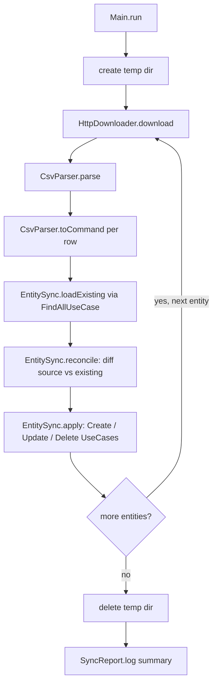
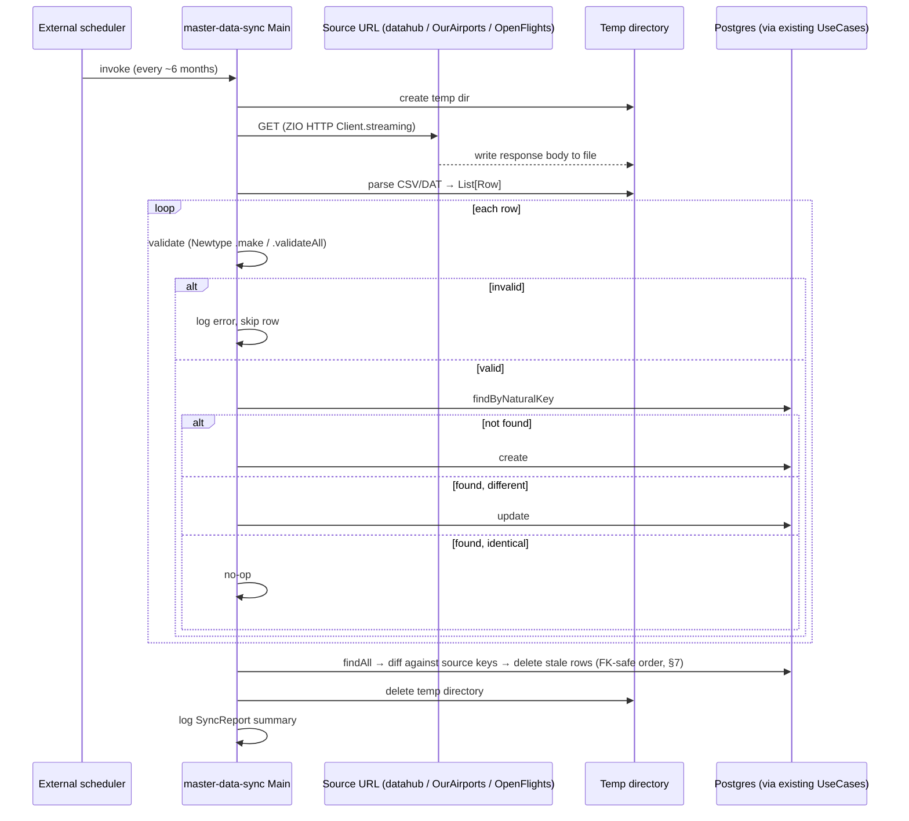

# Master Data Management — Download & Sync for Country / Airport / Airline

> **Status:** Analysis — architecture decided; **all three in-scope entities (Country, Airport,
> Airline) fully implemented and verified against a real Postgres.** `Main` downloads each source into
> a temp dir, parses it, reconciles it against the corresponding table via the entity's own `XxxSync`
> (`EntitySync.loadExisting`/`.reconcile`/`.apply`, backed by `findAllUnbounded` and the real
> `Create`/`Update`/`DeleteXxxService`), then cleans up. Country verified live: starting from 1 existing
> row (`ES, Spain`), a run created the other 248 and logged
> `created: 248, updated: 0, deleted: 0, unchanged: 1`; a second run against the now-249-row table
> reported `unchanged: 249` (idempotent, no writes). Airport verified live: starting from 0 rows, a run
> created 4,534 and logged `created: 4534, updated: 0, deleted: 0, unchanged: 0, skippedConflict: 1`
> (the one skip is Priština's airport — OurAirports tags it `iso_country = "XK"` for Kosovo, not a real
> ISO 3166-1 alpha-2 code); a second run reported `unchanged: 4534` (idempotent, no writes). Airline
> verified live: starting from 0 rows, a run created 1,009 and logged
> `created: 1009, updated: 0, deleted: 0, unchanged: 0, skippedInvalid: 17, skippedConflict: 7`; a
> second run reported `unchanged: 1009` (row count stable — see §9 for the 7-row duplicate-ICAO nuance,
> a source-data quirk, not a correctness problem). Airline's redesign (dropped `foundationDate`, added
> `alias`/`callsign` — `plans/redesign-airline-drop-foundation-date.md`) resolved its two structural
> gaps before the sync tool was built, rather than working around them. See
> `plans/masterdata/master-data-sync-scaffold.md`, `plans/masterdata/http-downloader-country.md`,
> `plans/masterdata/country-csv-parser.md`, `plans/masterdata/entity-sync.md`,
> `plans/masterdata/country-sync-wiring.md`, `plans/masterdata/airport-sync.md`, and
> `plans/masterdata/airline-sync.md`.
> Covers data source selection, sync architecture, reconciliation algorithm, validation/error
> handling, and open decisions for a low-frequency (~6-month) external master-data refresh.

---

## 1. Goal & scope

Countries, Airports, and Airlines are reference/master data — external, changing rarely (a few times a
year at most: new airports open, airlines rebrand or cease operating, country codes are essentially
static). This project currently seeds them by hand (`plans/seed-data-*.sql`, a one-time manual import)
or via each entity's own CRUD API, one row at a time. The goal is a repeatable process that:

1. Downloads the current authoritative list for each entity to a temporary directory.
2. Reconciles it against what's stored, so the downloaded list becomes that entity's single source of
   truth: rows present only in the source are created, rows present in both with different values are
   updated, rows present locally but absent from the source are deleted.
3. Validates every row and logs errors/issues without aborting the whole run.
4. Deletes the temporary directory when done.
5. Repeats on a ~6-month cadence.

**In scope:** Country, Airport, Airline — matches what was asked for explicitly.

**Out of scope:** Aircraft (registrations) and Route. Both are operational data created by an airline
through the app's own API (a specific tail number, a specific city pair an airline decides to fly),
not externally-authoritative reference data with a natural "master list" to sync against.

---

## 2. Data sources

### 2.1 Country — selected

**Source:** `https://datahub.io/core/country-list/_r/-/data.csv`
(redirects to `r2.datahub.io/.../data.csv`).

Confirmed by fetch: 249 data rows, two columns (`Name,Code`) — matching the 249 ISO 3166-1 alpha-2
codes already seeded into `country_codes` by `V12__create_country_codes.sql`.

```csv
Name,Code
Afghanistan,AF
Albania,AL
Algeria,DZ
...
"Bonaire, Sint Eustatius and Saba",BQ
"Palestine, State of",PS
"Saint Helena, Ascension and Tristan da Cunha",SH
"Tanzania, the United Republic of",TZ
```

4 of the 249 rows contain a comma inside a quoted `Name` field, so a plain `split(",")` would corrupt
them — but rather than pull in the `scala-csv` dependency (§4.2, reserved for Airport/Airline's larger,
more irregular files) for a fixed two-column format this simple, **Country parsing is a single regex
per line, not a library call:**

```
^(?:"([^"]+)"|([^,]+)),([A-Za-z]{2})$
```

Group 1 or 2 is the name (quoted-with-comma vs. plain), group 3 is the code — anchored so the code
must be exactly 2 letters, which also means the header line (`Name,Code` — `Code` is 4 letters) simply
fails to match and is skipped explicitly by line number, not logged as a parse error (an expected line,
not a data problem). **Decided:** every line after the header that fails to match this pattern is a
tolerated parse error — logged with the raw line, then skipped, same as a domain-validation failure
(§8) — never aborts the rest of the file.

| Column | Domain mapping |
|---|---|
| `Code` | `Country.code` (`CountryCode`) |
| `Name` | `Country.name` |

Underlying dataset is `datasets/country-list` on GitHub, same public-domain-family lineage as the rest
of the `datasets/*` collection on datahub.io — no attribution requirement.

### 2.2 Airport — selected

**Source:** OurAirports `airports.csv` (`https://ourairports.com/data/airports.csv`) — licensed
**Open Data Commons Public Domain Dedication and License v1.0 (PDDL)**, fully public domain, no
attribution required. Regenerated daily (a GitHub mirror also exists at
`davidmegginson.github.io/ourairports-data/airports.csv`, but the canonical source is the site
itself).

| Column | Domain mapping | Notes |
|---|---|---|
| `iata_code` | `Airport.iataCode` | **Filter**: skip rows with a blank `iata_code` — most of the ~80k rows (heliports, closed strips, ultralight fields) have none |
| `icao_code`, falling back to `ident` | `Airport.icaoCode` | **Implemented, corrected from the original sketch below.** Confirmed against the live 85,797-row file: `icao_code` is a *dedicated* column, separate from `ident` (OurAirports' own row identifier) — `icao_code` holds the real ICAO code when present, while `ident` is a non-ICAO-shaped internal id for ~126 large/medium airports (e.g. `"AE-0221"`) whose `icao_code` still has the real 4-letter code. Preferring `icao_code`, falling back to `ident` only when `icao_code` is blank, recovered 4,535 of 5,276 large/medium rows vs. ~4,294 using `ident` alone. **Filter**: keep only rows where the chosen value matches `AirportIcaoCode`'s `^[A-Za-z]{4}$` shape, log+skip the rest. (Original sketch, superseded: "`ident` → `Airport.icaoCode` ... falls back to a locally-generated code for airports without one" — written before the dedicated `icao_code` column was confirmed live.) |
| `name` | `Airport.name` | |
| `municipality` | `Airport.city` | |
| `iso_country` | Country relationship (`AirportRepository.save`'s separate `countryCode` param) | Already ISO 3166-1 alpha-2, same code space as `Country.code` |
| `type` | Row filter, not persisted | See §9 — recommend keeping only `large_airport`/`medium_airport` (reliable IATA coverage); full enum: `balloonport`, `closed_airport`, `heliport`, `large_airport`, `medium_airport`, `seaplane_base`, `small_airport` |

### 2.3 Airline — selected, with caveats

**Source:** OpenFlights `airlines.dat`, repo `github.com/jpatokal/openflights` → `data/airlines.dat`.
Raw download URL for programmatic fetch: `https://raw.githubusercontent.com/jpatokal/openflights/master/data/airlines.dat`
(the `github.com/.../blob/...` form is the HTML viewer page, not fetchable as a plain file). No header
row, 8 comma-separated columns, `\N` marks a null field:

| # | Column | Domain mapping | Notes |
|---|---|---|---|
| 1 | Airline ID | — | OpenFlights' own surrogate id, not used |
| 2 | Name | `Airline.name` | |
| 3 | Alias | `Airline.alias` (`Option[String]`) | **Implemented.** Blank/`\N` → `None` |
| 4 | IATA | — | not modeled (`Airline` has no IATA-code field, only ICAO) |
| 5 | ICAO | `Airline.icao` (`AirlineIcaoCode`) | **Filter**: skip blank/`\N` |
| 6 | Callsign | `Airline.callsign` (`Option[String]`) | **Implemented.** Blank/`\N` → `None` |
| 7 | Country | Country relationship | **Implemented** via a name→`CountryCode` lookup (live-fetched `Country` list + a small static alias table for OpenFlights' name variants, e.g. `"United States"` → `"United States of America (the)"`) — see `plans/masterdata/airline-sync.md`. Not every name resolves; unmapped rows are logged+skipped like any other unresolvable row (§8) |
| 8 | Active (`Y`/`N`) | Row filter | Recommend keeping only `Active = Y` |

**One structural gap found during research, resolved by removal rather than a workaround:**

- **No founding-date column** was ever available from this source — confirmed against OpenFlights'
  own schema docs (openflights.org/data.php): `airlines.dat` has exactly 8 fields, none a date.
  `Airline.foundationDate: LocalDate` was `NOT NULL` in both the schema
  (`V9__add_airline_foundation_date.sql`) and the domain model, with nothing to fill it from.
  **Resolved by dropping `foundationDate` from the entity entirely** (`V15__redesign_airline_columns.sql`)
  and modeling `alias`/`callsign` instead — two fields the source actually provides that `Airline`
  didn't capture before. See `plans/redesign-airline-drop-foundation-date.md`.
- **Stale, community-maintained snapshot.** OpenFlights' own documentation describes the GitHub copy
  as "only a sporadically updated static snapshot of the live OpenFlights database" — no fixed refresh
  cadence. Licensed **ODbL + DbCL** (attribution + share-alike, but only on *public* redistribution of
  the data — not a concern here since it lands in a private app DB, worth recording anyway).

No better free, structured, machine-readable alternative surfaced during research (IATA's own Airline
Coding Directory is a paid product; Wikipedia's airline-code lists are HTML tables, not a stable feed).

---

## 3. Architecture

New standalone module, following this project's existing pattern for a non-wired, independently
runnable tool (`migration`, `integration-tests`). It's an independent Scala application — a
`ZIOAppDefault` `Main`, packaged and run separately from `bootstrap` — that depends on `domain` +
`application` + `persistence-quill` (the same layers `bootstrap` wires) and drives the **existing**
`Create`/`Update`/`Delete`/`FindAll` use cases (application layer), backed by the existing Quill
repositories (persistence layer), for Country, Airport, and Airline. This keeps every validation and
persistence rule (Newtype `.make`, uniqueness pre-checks, FK resolution, SQLState mapping) as the
single implementation shared with the HTTP path — the sync tool is just another *driving* adapter,
like `adapter-http`, except its driver is an OS-scheduled process instead of an HTTP request.

### 3.1 Module & package naming

| | Decision |
|---|---|
| Directory | `infrastructure/master-data-sync` |
| sbt project val / `name` | `masterDataSync` / `"master-data-sync"` |
| Base package | `dev.cmartin.aerohex.infrastructure.masterdata` — one compact segment, same shape as `migration`'s single-segment package. This module is one specific tool, not a "capability + implementation choice" pair the way `messaging.kafka`/`persistence.quill` are (two dotted segments each), so it doesn't follow that half of the existing convention. |

Target end state (the `.dependsOn`/CSV deps land incrementally as the pipeline below gets built).
Current state: `.dependsOn(domain)` is real (added for `CountryCsvParser.toCommand`,
`plans/masterdata/country-csv-parser.md`) — `application`/`persistenceQuill` and `scalaCsv` are
still not needed, since nothing in this module persists a command yet or parses Airport/Airline's
files:

```scala
// build.sbt — new project block, alongside migration/messagingKafka/persistenceQuill
lazy val masterDataSync = project
  .in(file("infrastructure/master-data-sync"))
  .dependsOn(domain, application, persistenceQuill)
  .settings(
    name := "master-data-sync",
    libraryDependencies ++= Seq(
      zio,
      zioStreams,
      zioHttp,
      zioNio, // dev.zio:zio-nio — §4.3, already added
      scalaCsv, // com.github.tototoshi:scala-csv — new dependency, §4.2
      zioLogging,
      zioLoggingSlf4j,
      logback
    ),
    Compile / mainClass := Some("dev.cmartin.aerohex.infrastructure.masterdata.Main")
  )
  .settings(coverageSettings*)
```

Not added to `coverageProjects`/`root`'s `.aggregate(...)` — same rationale as `integration-tests`: a
different lifecycle (externally triggered, not "always running with the HTTP server") and different
infrastructure needs (outbound internet access to the source URLs, a writable temp directory).
`sbt-assembly` stays enabled (unlike most non-`bootstrap` modules, which `.disablePlugins(AssemblyPlugin)`)
since this module — like `bootstrap` — needs a runnable fat jar for the OS-cron invocation (§9).

### 3.2 File layout

Flat in the `masterdata` package root, not nested under `downloader/`/`parser/`/`sync/` subpackages
as originally sketched here — settled once `TempDirectory`/`HttpDownloader`/`CountryCsvParser` were
actually built (§4.3/§4.4/§4.5): a handful of files doesn't need subpackage navigation overhead, and
matches this project's other small infrastructure modules (`migration`'s single-segment package).
Revisit if the file count grows enough that a flat package stops being easy to scan.

```
infrastructure/master-data-sync/
  src/main/scala/dev/cmartin/aerohex/infrastructure/masterdata/
    Main.scala                    ← ZIOAppDefault entry point — implemented for Country, Airport, and Airline, in sequence (no CLI arg parsing)
    TempDirectory.scala           ← create/delete lifecycle, §4.3 — implemented
    HttpDownloader.scala          ← ZIO HTTP Client.streaming → file, §4.4 — implemented, reused unchanged for all three sources
    CountryCsvParser.scala        ← regex-based, no CSV library — §2.1/§4.5 — implemented (parse + toCommand)
    AirportCsvParser.scala        ← scala-csv-based — §2.2/§4.2 — implemented (parse + toCommand)
    AirlineCsvParser.scala        ← scala-csv-based, no header row — §2.3/§4.2 — implemented (parse + toCommand, plus a static country-name alias table)
    EntitySync.scala              ← generic reconcile-and-apply algorithm (§7), parameterized per entity — implemented (loadExisting/reconcile/apply), reused unchanged for Airport and Airline
    CountrySync.scala             ← implemented — parses, validates, reconciles, and applies real Create/Update/DeleteCountryService calls
    AirportSync.scala             ← implemented — same shape as CountrySync, but reconciles `(Airport, CountryCode)` pairs since Airport carries its country relationship separately from the entity itself (§9)
    AirlineSync.scala             ← implemented — same shape again, plus resolving each row's free-text country name to a CountryCode via a live-fetched Country list (§9)
    SyncReport.scala              ← created/updated/deleted/skipped counters + per-row error log — implemented, reused unchanged for Airport and Airline
```

---

## 4. Tech & dependencies

### 4.1 Already used in the project — reused as-is

| Concern | Choice | Version | Notes |
|---|---|---|---|
| Core effect system | `zio` | `2.1.26` | Every module in this project declares it explicitly, even where it'd also arrive transitively — followed here for consistency. |
| HTTP download | **ZIO HTTP `Client`**, streaming mode | `3.11.3` | `ZIO.scoped { Client.streaming(Request.get(url)).flatMap(_.body.asStream.run(ZSink.fromFile(tmpFile))) }` (per current `zio-http` docs). Already used elsewhere (`adapter-http`/`bootstrap`); listed here too since this module doesn't `dependsOn(adapterHttp)`. Batched mode is unsuitable for the Airport file (OurAirports' full `airports.csv` is tens of MB); streaming avoids buffering it all in memory. |
| Postgres JDBC driver | `org.postgresql:postgresql` | `42.7.13` | Not declared directly — arrives transitively through `.dependsOn(persistenceQuill)` (§3.1), same as `hikaricp`. |
| ORM / query DSL | **ProtoQuill** (`quill-jdbc-zio`) | `4.8.6` | Also transitive via `.dependsOn(persistenceQuill)` — the sync tool never issues SQL itself, it calls the existing use cases, already backed by `QuillCountryRepository`/`QuillAirportRepository`/`QuillAirlineRepository`. |

### 4.2 New to this module — need adding to `Dependencies.scala`/`Versions.scala`

| Concern | Choice | Version | Rationale |
|---|---|---|---|
| CSV parsing (Airport, Airline only) | **`scala-csv`** (`com.github.tototoshi:scala-csv`, `_3` artifact) | `2.0.0` | See the comparison below. Country doesn't use this dependency — it's parsed with a regex instead (§2.1), simple enough not to need a library. |
| Streaming to disk | **`zio-streams`** (`dev.zio:zio-streams`) | `2.1.26` (matches `zio`) | Needed for `ZSink.fromFile`/`ZStream` on the download path. Already declared as an unused `val` in `Dependencies.scala` — this would be its first real consumer. |
| Temp directory (create + guaranteed cleanup) | **`zio-nio`** (`dev.zio:zio-nio`, `_3` artifact) | `2.0.2` | See §4.3 below. Replaces an earlier plan to hand-roll this on top of plain `java.nio.file.Files`. |
| Logging | **zio-logging** + **zio-logging-slf4j2** + **logback** | `2.5.3` / `2.5.3` / `1.5.38` | Same trio `bootstrap` uses. A separate JVM entry point needs its own `logback.xml`, not a shared one. |

#### CSV library comparison

Goal for this pick: least code, most ZIO-ecosystem fit, without dropping below this project's bar for
a stable/mature direct dependency (`CLAUDE.md`'s versioning policy). No first-party `zio-csv` exists.

| Library | Scala 3 | ZIO fit | Maturity | Code shape | Verdict |
|---|---|---|---|---|---|
| `kantan.csv` | **No** — 2.12/2.13 only | — | 0.8.0, Scala-3-stalled | — | Disqualified |
| `csv3s` | Yes | **Best** — built on `zio-parser` + Magnolia | 7 GitHub stars, no visible production use | Small (derivation) | Rejected — fails the maturity bar despite the best ecosystem fit |
| `fs2-data-csv` | Yes | None — pulls in fs2/cats-effect | 1.13.0, actively maintained | Small (derivation) | Rejected — wrong effect ecosystem for a ZIO-only module |
| Apache Commons CSV | N/A (plain Java) | None | 412 stars, Apache Commons project | More code — `CSVFormat` builder + `CSVParser` + index-based `CSVRecord` access | Solid fallback, not picked — more boilerplate |
| **`scala-csv`** | **Yes** (`_3` artifact) | None, but the call site is one line: `CSVReader.open(file).all(): List[List[String]]` | 710 stars, 28 releases | Least code of any viable choice | **Selected** |

Every option needs the same `ZIO.attempt` wrap except `csv3s` — and `csv3s` doesn't clear the maturity
bar on its own merits (7 stars, no evidence of production use), so it isn't worth trading a real
maintenance risk for a marginal ergonomics win. Between the two mature options, `scala-csv` wins on
"reduce code": `.all()` returns rows directly, whereas Commons CSV needs a `CSVFormat` builder, a
`CSVParser`, and index-based `CSVRecord` field access. (Rejected-alternatives summary: §10.)

### 4.3 Temporary directory — creation & cleanup

**Decided and implemented** — see `plans/masterdata/master-data-sync-scaffold.md`: `zio-nio`'s `Files.createTempDirectory`/`deleteRecursive`, exposed as
this module's own `TempDirectory.create`/`delete` (`infrastructure/master-data-sync`), composed via
`ZIO.acquireRelease` in `Main` for guaranteed cleanup. Closes a recursive-delete gap a hand-rolled
`java.nio.file.Files` wrapper would otherwise need to implement itself (`JFiles.delete` only removes
an *empty* directory).

**Caveat:** `zio-nio`'s most recent release (`v2.0.2`) is from October 2023 — dormant relative to this
project's actively-released `zio`/`zio-http` core dependencies. The surface used here is a thin,
stable wrapper, keeping the practical risk low.

Rejected alternatives: hand-rolled `java.nio.file.Files` + manual recursive delete, `better-files`,
`os-lib`, `scala.reflect.io.Directory` (§10).

### 4.4 HTTP download — client comparison

**Decided and implemented** (Country source only, §2.1) — see `plans/masterdata/http-downloader-country.md`:
`zio-http` `Client.streaming`, already a main-scope build dependency (used server-side in
`adapter-http`), so no new artifact. Two requirements confirmed necessary, not hypothetical:
redirect-following (Country's source URL redirects, `datahub.io/core/country-list/...` →
`r2.datahub.io/...`, confirmed live) via `ZClientAspect.followRedirects` composed with
`ZIO#updateService[Client]`; and an explicit `Status.isSuccess` check before writing, so a `404`/`500`
error page's body never gets written to disk as if it were the real payload.

Test approach: a plain `zio.http.Server` bound to port 0, routes installed once at shared-layer build
time — no prior precedent in this codebase for testing an HTTP *client*.

Rejected alternatives: `java.net.http.HttpClient`, `sttp-client4`, Apache HttpClient/OkHttp,
`zio-http-testkit` (for testing) (§10).

### 4.5 File line reading — comparison

**Decided and implemented** (Country's `parse` only so far) — see `plans/masterdata/country-csv-parser.md`:
`zio-nio`'s `Files.readAllLines` — already
a dependency of this module (added for `TempDirectory`, §4.3), zero new footprint. Eager/in-memory,
right-sized for Country's ~4 KB/249-row file; `zio-nio`'s streaming alternative, `Files.lines`, is the
right tool for a much larger file (Airport's OurAirports source is "tens of MB") — deferred to that
future increment.

Rejected alternatives: plain `java.nio.file.Files.readAllLines`, `scala.io.Source`, `zio-streams`'
`ZStream.fromFile` + `ZPipeline.splitLines`, `scala-csv` (§10).

---

## 5. Main flow (happy path)

Before the detailed reconciliation logic (§7) and before alternative/error cases (a later revision of
this doc — invalid rows, unreachable source URLs, DB conflicts, partial-run failures), here is the
straight-line, everything-succeeds path through **one** entity's sync. All three entities (Country,
Airline, Airport) follow this identical shape, just parameterized differently (`CountrySync`/
`AirlineSync`/`AirportSync`, §3.2).

### 5.1 Components & functions

| Component | Function | Responsibility |
|---|---|---|
| `Main` (`ZIOAppDefault`) | `run` — implemented for Country and Airport | Orchestrates the entity syncs in order (Country, then Airport, then eventually Airline), owns the temp-dir lifecycle. Each entity's real Quill-backed use-case layers are composed the same way `bootstrap`'s `WiringModule` does (`QuillDataSourceLayer.live >>> QuillXxxRepository.layer`, then `>>>` per service, combined with `++`); Airline orchestration not added yet |
| `HttpDownloader` | `download(url: String, destFile: Path): ZIO[Client, Throwable, Path]` — implemented, reused unchanged for both Country and Airport sources | Streams the source URL to `destFile` (ZIO HTTP `Client.streaming` + redirect-following + non-2xx check, §4.4). `url: String`/`destFile` (a specific file, not a dir) — small deviations from this table's original sketch, settled once the component was actually built; logs start/success-with-size/failure (`ZIO.logInfo`/`logError`). Airport's OurAirports URL currently 301-redirects to a GitHub mirror — already covered by the existing `followRedirects`, confirmed live, no code change needed |
| `CountryCsvParser` | `parse(file: Path): IO[IOException, List[CountryRow]]` — implemented | Skips the header line by position (never logged), then matches each remaining line against the §2.1 regex via `zio-nio`'s `Files.readAllLines` (§4.5) — no CSV library. A non-matching line is a tolerated parse error: logged at `WARN` with the raw line, skipped, processing continues (§8). `CountryRow`/`IOException`, not `SourceRow`/`Task` — settled once actually built, same as `HttpDownloader`'s deviations |
| same parser | `toCommand(row: CountryRow): IO[DomainError, CreateCountryCommand]` — implemented | Mirrors the existing HTTP create path exactly (`CreateCountryRequest.toCommand`, `adapter-http/.../CountryDto.scala`): `CountryCode.validateAll` (accumulating, not `.make`'s fail-fast), folded into `DomainError.InvalidCountryCode` via `.toEitherWith` + `ZIO.fromEither`. `IO[DomainError, CreateCountryCommand]`, not the sketch's `Either[String, Command]`. First function in this module needing `domain` — `master-data-sync` now has `.dependsOn(domain)` in `build.sbt` (§3.1); `application`/`persistenceQuill` still not needed, since this only builds a command, it doesn't persist one |
| `AirportCsvParser` | `parse(file: Path): Task[List[AirportRow]]` — implemented | Reads the downloaded file with `scala-csv`'s `CSVReader.open(file.toFile).allWithHeaders()` (§2.2/§4.2), filters to `large_airport`/`medium_airport` rows (§9, silent — an expected exclusion, not a data problem), then per row: skips (logs `WARN`) a blank `iata_code` or a value that's neither `icao_code` nor its `ident` fallback in `AirportIcaoCode`'s 4-letter shape. `Task`, not `IO[IOException, _]` — `scala-csv` can throw more than `IOException` |
| same parser | `toCommand(row: AirportRow): IO[DomainError, CreateAirportCommand]` — implemented | Mirrors `CreateAirportRequest.toCommand` (`adapter-http/.../airport/AirportDto.scala`) exactly: `IataCode.validateAll`/`AirportIcaoCode.validateAll` (accumulating) folded into `DomainError.InvalidIataCode`/`InvalidAirportIcaoCode`; `countryCode = CountryCode.unsafeMake(row.countryCode)` — a reference field, unvalidated at this boundary per `CLAUDE.md`'s convention |
| `AirlineCsvParser` | `parse(file: Path): Task[List[AirlineRow]]` — implemented | `scala-csv`'s `CSVReader.open(file.toFile).all()` — no header row, unlike Country/Airport, so columns are read positionally (§2.3). Filters to `active == "Y"` (silent — an expected exclusion, §8), then skips (logs `WARN`) a row whose ICAO isn't a valid 3-letter shape. `\N`/blank → `None` for `alias`/`callsign` |
| same parser | `toCommand(row: AirlineRow, countryNameToCode: Map[String, CountryCode]): IO[DomainError, CreateAirlineCommand]` — implemented | Mirrors `CreateAirlineRequest.toCommand` (`adapter-http/.../airline/AirlineDto.scala`) for `AirlineIcaoCode.validateAll`; unlike Country/Airport's `toCommand`, takes a second parameter — the source's `Country` column is a free-text *name*, not a code, so resolving it needs the caller-supplied live country-name map (built once in `AirlineSync.sync`, not per-row) plus a static `countryNameAliases` table for known name variants (§9). Fails with `DomainError.CountryNotFound` (reused, not a new case) when a name doesn't resolve |
| `EntitySync` | `loadExisting[K, E](findAll: UIO[List[E]], keyOf: E => K): UIO[Map[K, E]]` — implemented, reused unchanged for Airport and Airline | Gets everything currently stored, keyed by natural key; takes the already-built `findAll` effect rather than a repository/use-case directly — each entity's `XxxSync` supplies its own unbounded read (§7.1). Airport's and Airline's `findAllUnbounded` both return `IO[DomainError, _]` (matching their own existing convention, unlike Country's `UIO`), so `AirportSync`/`AirlineSync` both adapt via `.orDieWith(...)` before passing it here |
| `EntitySync` | `reconcile[K, E](source: List[E], existing: Map[K, E], keyOf: E => K): SyncPlan[K, E]` — implemented, reused unchanged for Airport and Airline | Pure diff, no I/O — buckets each source row into `toCreate`/`toUpdate`/`unchanged` (plain `==` equality, §9) and every leftover `existing` key into `toDelete` (§7.2). `SyncPlan[K, E](toCreate: List[E], toUpdate: List[E], toDelete: List[K], unchanged: Int)`. For Airport and Airline, the `==` on the bare entity can't see a country-only change (§9's documented gap); for Airline specifically, a handful of source rows sharing one ICAO code under different names (an OpenFlights data quirk, not this code) can also cycle between `toCreate`/`toUpdate` across separate runs — see §9 |
| `EntitySync` | `apply[K, E](plan, create, update, delete): UIO[SyncReport]` — implemented, reused unchanged for Airport and Airline | Calls the entity's existing `Create`/`Update`/`Delete` use cases for each bucket, each via a caught effect — a failure is logged at `WARN` and counted as `skippedConflict`, never propagated (the generic mechanism behind §7.2's FK-violation-per-row handling). Verified live for Airport: Priština's airport (`iso_country = "XK"`, not a real country code) correctly skipped as `CountryNotFound`. Verified live for Airline: 7 duplicate-ICAO source rows correctly caught as `AirlineAlreadyExists`/skipped, none aborted the run |
| `AirportSync` | `sync(file: Path): ZIO[CreateAirportUseCase & UpdateAirportUseCase & DeleteAirportUseCase & FindAirportUseCase, Throwable, SyncReport]` — implemented | Same shape as `CountrySync.sync`, but the comparable `E` passed into `EntitySync` is `(Airport, CountryCode)`, not bare `Airport` — `Airport` itself carries no `countryCode` field, so this lets `EntitySync.reconcile`'s `==` diff also catch a source row whose *only* change is its country. The *existing* side of that pair comes from `FindAirportUseCase.findAllUnboundedWithCountry` (one joined query); the *source* side is built straight from the parsed commands |
| `AirlineSync` | `sync(file: Path): ZIO[CreateAirlineUseCase & UpdateAirlineUseCase & DeleteAirlineUseCase & FindAirlineUseCase & FindCountryUseCase, Throwable, SyncReport]` — implemented | Same shape again, plus `FindCountryUseCase` in its environment (reusing exactly what `CountrySync` already needs, no new dependency) to fetch the live `Country` list once for `AirlineCsvParser.toCommand`'s country-name resolution. Reconciles `(Airline, CountryCode)` pairs the same way `AirportSync` does, via `FindAirlineUseCase.findAllUnboundedWithCountry` |
| `Main` | cleanup | Deletes the temp dir (`TempDirectory.create`/`delete` via `ZIO.acquireRelease`, §4.3 — already implemented) once every entity has run |
| `SyncReport` | `log(): UIO[Unit]` — implemented | Emits one summary line (`ZIO.logInfo`) with all six counters; `created`/`updated`/`deleted`/`unchanged`/`skippedConflict` come from `EntitySync.apply`, `skippedInvalid` stays `0` until a future increment sums in the parse/`toCommand` stage's skip count |

### 5.2 Flow diagram



This is the all-valid, all-successful path only. §7 already settles FK-delete ordering and §8 already
settles per-row validation, both referenced above since they're decided; genuinely new alternative
flows and error handling (source unreachable, partial-run recovery, etc.) come in a later pass, as
agreed.

---

## 6. Sync flow



Order across entities: **Country, then Airport and Airline** (the latter two are independent of each
other, both depend only on Country existing first for creates/updates). Implemented and verified for
all three, in this order.

---

## 7. Reconciliation algorithm & FK-safe deletes

### 7.1 Loading "existing" data for the diff

Every existing `findAll` — both the port/in use case (`FindCountryUseCase.findAll`,
`domain/.../country/FindCountryUseCase.scala:9`, and the Airport/Airline equivalents) and the port/out
repository method behind it — takes a `Pagination` argument, clamped to a maximum `pageSize` of 100
(`shared-kernel/Pagination.scala:9-10`, BR-12). There is no existing unpaginated "get everything" call
for any of the three entities; getting a full table today would mean looping pages client-side.

For **Country** — a fixed 249-row reference table — it's an accepted simplification to skip that loop:
**implemented.** `FindCountryUseCase.findAllUnbounded: UIO[List[Country]]` delegates to
`CountryRepository.findAllUnbounded`, backed by an un-clamped `SELECT ... ORDER BY code` in
`QuillCountryRepository` (and, kept schema-consistent, `DoobieCountryRepository`). This was additive —
Airport/Airline's paginated `findAll` and every HTTP-facing paginated behavior are untouched. Whether
the same bypass extends to **Airport**/**Airline** (plausibly thousands of rows each after the
§2.2/§2.3 filters, not hundreds) is still open — see §9.

### 7.2 Reconciliation & delete ordering

"Downloaded list is the single source of truth" (the agreed conflict policy — upsert, external source
always wins) means a row that disappears from the source gets deleted locally, not just left alone.
Two ordering constraints follow directly from the schema's FKs:

- **Creates/updates**: Country before Airport/Airline (`airports.country_id`/`airlines.country_id` FK
  to `countries.id`).
- **Deletes**: the reverse — Airport/Airline before Country. Deleting a `Country` whose code drops out
  of the source, while an `Airport`/`Airline` still referencing it hasn't *also* dropped out (an
  inconsistent source snapshot, or simply Airport/Airline sync running in a separate invocation), would
  violate the FK and fail at the DB. Since the persistence layer already maps
  `sqlstate.class23.FOREIGN_KEY_VIOLATION` to a `DomainError`, the sync tool should **catch that
  specific error per-row, log it as a skipped conflict, and continue** — one dangling reference must
  never abort the rest of the run.

Per-row identity for the diff is each entity's existing natural key (`CountryCode`/`IataCode`/
`AirlineIcaoCode`) — the same key `findByX` already looks up on the HTTP path.

---

## 8. Validation & error handling

Two distinct failure stages, tolerated identically — log and skip, never abort the file:

1. **Parse-level.** A line that doesn't fit the source's shape at all — for Country, a line not
   matching §2.1's regex (`scala-csv` throwing on a malformed row for Airport/Airline, caught by
   `ZIO.attempt`). The row never becomes a `SourceRow`.
2. **Validation-level.** A row that parses fine but fails a domain rule. Reuse the exact validators
   already wired into each `Create...Request.toCommand`: `CountryCode.make`, `IataCode.make` +
   `AirportIcaoCode.make`, `AirlineIcaoCode.make`.

Either way, the row is logged with the source content and the specific reason, then skipped. `SyncReport`
accumulates counts (`created`/`updated`/`deleted`/`unchanged`/`skippedInvalid`/`skippedConflict`) per
entity and logs a one-line summary at the end, plus every skip at `WARN` with enough context (natural
key + reason) to act on without re-running.

---

## 9. Open decisions

| Topic | Recommendation | Notes |
|---|---|---|
| Airport `type` filter | **Decided and implemented.** `large_airport` + `medium_airport` only | `small_airport`/`heliport`/`closed_airport`/etc. rarely carry a real IATA code; revisit if a future use case needs smaller fields. Implemented in `AirportCsvParser.parse` as a silent exclusion (§8) — verified live, 5,276 of 85,797 rows matched. See `plans/masterdata/airport-sync.md` |
| Airline `foundationDate` gap | **Resolved — removed, not defaulted.** `foundationDate` dropped from `Airline` entirely; `alias`/`callsign` (real OpenFlights fields) modeled instead | No source ever supplied this field (confirmed against OpenFlights' own schema docs — 8 fields, no date). Removing it, rather than a sentinel/nullable workaround, means the sync tool needed no special-casing at all for this field. See `plans/redesign-airline-drop-foundation-date.md` |
| Airline `Country` (name, not code) | **Decided and implemented.** Small static name→`CountryCode` lookup table (via a live-fetched `Country` list); log+skip unmatched names | Country-name spelling varies across sources (e.g. `"Turkey"` → `"Türkiye"`, `"Russia"` → `"Russian Federation (the)"`) — verified live: 148 of 196 distinct active-airline country names matched directly, the rest covered by the alias table or correctly left unmapped (e.g. `"Netherlands Antilles"`, dissolved 2010). See `plans/masterdata/airline-sync.md` |
| CSV library | **Decided.** `scala-csv` 2.0.0 (Country parses via regex instead, §2.1) | Full comparison and rejected alternatives: §4.2/§10 |
| Temp directory library | **Decided and implemented, with a caveat.** `zio-nio` 2.0.2 (`Files.createTempDirectory` + `deleteRecursive`, exposed as this project's own `TempDirectory.create`/`delete`) | Closes a recursive-delete gap the plain-JDK baseline leaves unimplemented; caveat is the dependency's own last release/commit being from Oct 2023. Rejected alternatives: §4.3/§10. See `plans/masterdata/master-data-sync-scaffold.md` |
| HTTP download client | **Decided and implemented.** `zio-http` `Client`, Country source only so far | Already a build dependency, no new artifact; needs redirect-following (Country's source URL redirects) and non-2xx detection, both confirmed capabilities. Rejected alternatives: §4.4/§10. See `plans/masterdata/http-downloader-country.md` |
| File line reading | **Decided and implemented.** `zio-nio`'s `Files.readAllLines` (Country's `parse` function only so far) | Already a build dependency; eager/in-memory is right-sized for Country's ~4 KB file, unlike Airport's later tens-of-MB source. Rejected alternatives: §4.5/§10. See `plans/masterdata/country-csv-parser.md` |
| Scheduling mechanism | **Decided.** Standalone `ZIOAppDefault` app, packaged like `bootstrap` (`sbt-assembly`), invoked by an OS-level (`crontab`) entry on whatever host runs it — `0 0 1 */6 *` for a "1st of the month, every 6 months" cadence, or similar | The app has no built-in scheduling awareness — the OS decides when to run `java -jar master-data-sync.jar`. Rejected alternative (GitHub Actions `schedule:`): §10 |
| Dry-run mode | Recommend a `--dry-run` flag that logs the diff (create/update/delete counts + affected rows) without writing | Deletes are destructive and the Airline source has known gaps; a first run should be inspectable before it's trusted unattended |
| "Different" comparison for updates | **Decided and implemented.** Field-by-field equality on the mapped subset of columns only — plain `==` on the case class, no custom typeclass (`EntitySync.reconcile`) | Avoids spurious updates from OurAirports/OpenFlights columns this project doesn't model; correct today since Country's case class already contains exactly the mapped fields — revisit if a future entity's case class carries fields the source doesn't supply |
| Bulk-read for `loadExisting` — **all three entities done** | All three `findAllUnbounded` implementations (§7.1) are implemented and verified live | Twice-a-year batch job, so even a fully unbounded read of a few thousand rows is unlikely to be a real problem — but flagging rather than assuming. Airport's and Airline's are both `IO[DomainError, List[_]]` (matching each entity's own existing convention), not `UIO` like Country's — `AirportSync`/`AirlineSync` both adapt with `.orDieWith(...)` at the `EntitySync.loadExisting` call site. See `plans/masterdata/airport-sync.md`, `plans/masterdata/airline-sync.md` |
| Generic reconciliation algorithm (`EntitySync`) | **Decided and implemented, now wired end-to-end for all three entities.** Type-parameterized over `K`/`E`, fixed on `DomainError` as the create/update/delete error channel, never fails the fiber (caught + `WARN` log + counted as `skippedConflict`) | `CountrySync`/`AirportSync`/`AirlineSync` all drive it against the real `Create`/`Update`/`DeleteXxxService`s, verified live against Postgres (Country: created 248, then unchanged; Airport: created 4,534, then unchanged; Airline: created 1,009, then unchanged with a 7-row nuance — see below). `EntitySync` itself needed zero changes across all three entities — fully reused. The FK-violation-to-`DomainError` mapping gap in `QuillCountryRepository` (§7.2) is a separate, still-open problem — not a risk for Country alone (no FK references it), but relevant once a Country-deletion path is exercised (an Airport/Airline row disappearing from its own source only deletes that row, not the Country). See `plans/masterdata/entity-sync.md`, `plans/masterdata/country-sync-wiring.md`, `plans/masterdata/airport-sync.md`, and `plans/masterdata/airline-sync.md` |
| Airport/Airline reconcile diff can't detect a country-only change | **Fixed, both entities.** Neither `Airport`'s nor `Airline`'s case class has a `countryCode` field (the relationship is resolved separately via `save`/`.update`'s extra param), so `EntitySync.reconcile`'s `==` diff on the bare entity couldn't flag a source row whose *only* change was its country. Fixed by widening the comparable `E` type `AirportSync`/`AirlineSync` pass into `EntitySync` from the bare entity to a `(Entity, CountryCode)` pair | New bulk repository method `findAllUnboundedWithCountry: IO[DomainError, List[(Entity, CountryCode)]]` added to `AirportRepository`/`AirlineRepository` (+ `FindAirportUseCase`/`FindAirlineUseCase`, + Quill join-query implementations, + Doobie kept schema-consistent) — one query for the *existing* side, not a per-row `findCountryByIata`-style lookup. `AirportSync.sync`/`AirlineSync.sync` now build the *source* side the same way (`(Entity, CountryCode)` tuples straight from the parsed commands), so `EntitySync.reconcile` — itself untouched — sees both sides in the same shape and its plain `==` picks up a country-only change for free. This also let the old `countryCodeByIata`/`countryCodeByIcao` lookup maps be deleted; the country code now travels with the entity through the whole pipeline. Covered by new `AirportSyncSpec`/`AirlineSyncSpec` tests ("updates an existing ... whose country changed, with identical ... fields"). See `plans/masterdata/airport-sync.md`, `plans/masterdata/airline-sync.md` |
| Airline: duplicate ICAO codes within the OpenFlights source itself | **Fixed — deduplicated in `AirlineSync.sync`, not in `EntitySync`.** A handful of OpenFlights rows (7, verified live) share one ICAO code under different names (e.g. two distinct `JAL` entries). `AirlineSync.sync` now groups the parsed `commands` by ICAO before ever calling `EntitySync.reconcile`, keeps only the first row per ICAO, and logs+counts every dropped duplicate as `skippedInvalid` | `EntitySync.reconcile` itself needed no change — deduplication happens one layer up, at the call site that already knows the source is OpenFlights-shaped, so the otherwise-fully-generic reconcile stays untouched. Verified with a unit test (`AirlineSyncSpec`, "keeps only the first row when the source has two entries for the same ICAO"): the first row is created, the second is counted as `skippedInvalid`, and the run settles into a stable `unchanged` count on a later run since the source-side duplicate no longer alternates between create/update against the stored row. See `plans/masterdata/airline-sync.md` |
| Generalize `CountrySync`/`AirportSync`'s glue and `Main`'s per-entity layer-wiring | **Not yet — revisit once Airline lands.** `EntitySync`/`SyncReport`/`HttpDownloader`/`TempDirectory` are already generalized (parametric over `K`/`E`, reused unchanged by Airport); what's still duplicated is (1) each `XxxSync.sync`'s glue — `parse → toCommand-per-row → collect Rights → loadExisting → reconcile → apply → copy(skippedInvalid)` is structurally identical in `CountrySync`/`AirportSync`, differing only in the concrete `Row`/`Command`/`Entity`/`Key` types (plus Airport's extra `countryCodeByIata` step) — and (2) `Main`'s `countryRepoLayer`/`countryUseCasesLayer` vs `airportRepoLayer`/`airportUseCasesLayer`, same `QuillDataSourceLayer.live >>> QuillXxxRepository.layer` then `>>>`-per-service-`++`-combined shape repeated verbatim | Two instances (Country, Airport) risk guessing the wrong generic shape — build Airline first by copy-and-adapt, then extract a generic `EntitySync.syncEntity(parse, toCommand, toEntity, keyOf, create, update, delete, findAllUnbounded)` helper and a small generic layer-builder only if the third instance confirms the same shape (Rule of Three). If it does, generalize via **composition** (higher-order functions/type parameters, matching every other generic piece this module already has) — **not inheritance**; this codebase never uses class hierarchies for behavior reuse, only ZIO/FP composition, and traits here are hexagonal ports, not implementation base classes |

---

## 10. Rejected alternatives

| Rejected | Why |
|---|---|
| OpenFlights `airports.dat` for Airport data | Same OpenFlights staleness issue as Airlines; OurAirports (PDDL, regenerated daily) is a strictly better-maintained superset for this use case |
| ISO's own official 3166 data | Rejected — see §2.1 |
| In-app scheduled job (a ZIO fiber, like `OutboxRelay`) | The explicit choice was a standalone, externally-scheduled process, not an always-running poller inside `bootstrap` |
| GitHub Actions `schedule:` trigger | Would require the production Postgres reachable from CI runners — an assumption not made anywhere else in this repo; OS-level `crontab` on the host running the app needs no such exposure |
| Hard delete with no conflict handling | Rejected — `EntitySync.apply` catches and logs per-row instead (§7.2) |
| CSV libraries: `kantan.csv`, `csv3s`, `fs2-data-csv`, Apache Commons CSV | Full comparison and reasoning: §4.2. In short — `kantan.csv` has no Scala 3 build; `csv3s` is ZIO-native but too immature (7 GitHub stars); `fs2-data-csv` pulls in an effect ecosystem this project doesn't otherwise use; Commons CSV is mature but more boilerplate than `scala-csv` |
| Temp directory: plain `java.nio.file.Files` + hand-rolled recursive delete, `better-files`, `os-lib`, `scala.reflect.io.Directory` | Rejected — see §4.3 |
| HTTP download: `java.net.http.HttpClient`, `sttp-client4`, Apache HttpClient/OkHttp, `zio-http-testkit` (for testing) | Rejected — see §4.4 |
| File line reading: plain `java.nio.file.Files.readAllLines`, `zio-streams`' `ZStream.fromFile` + `ZPipeline.splitLines` | Rejected — see §4.5 |
